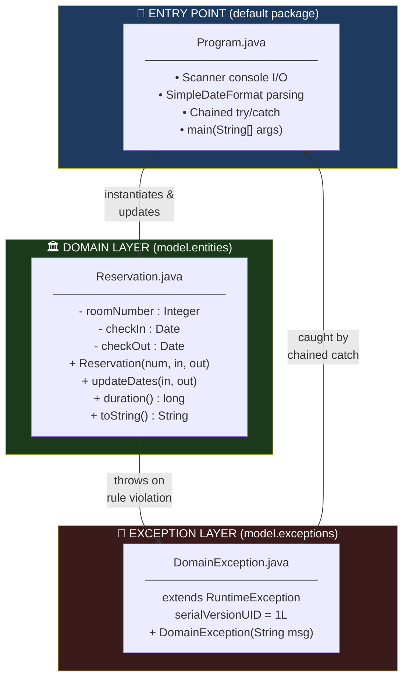
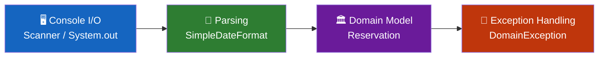
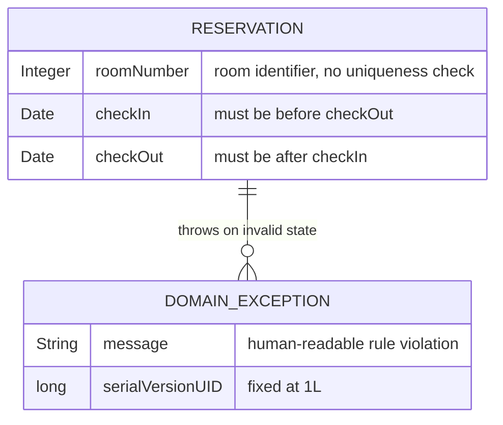
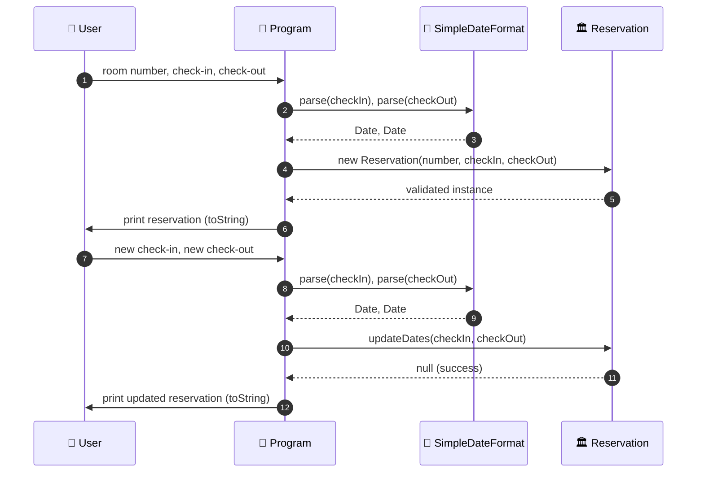
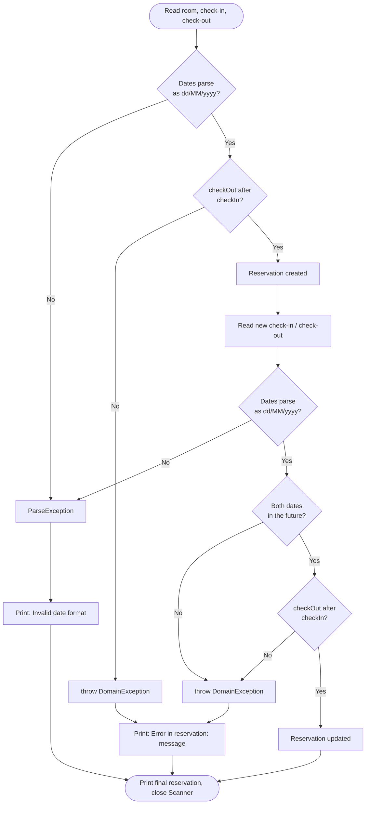
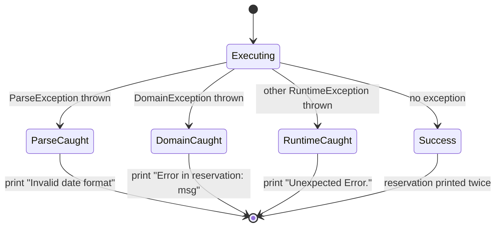
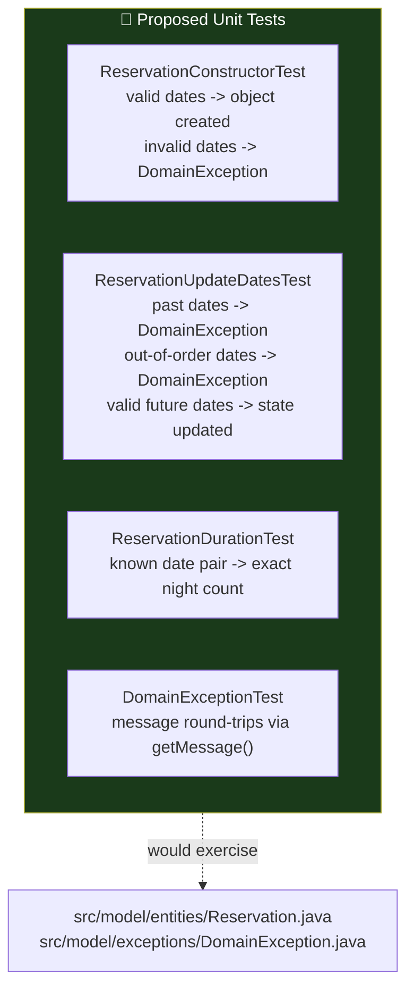

<div align="center">

**🌐 Choose Language / Selecione o Idioma / Elija el Idioma**

[](README.md)&nbsp;&nbsp;&nbsp;[](README_PT.md)&nbsp;&nbsp;&nbsp;[](README_ES.md)

</div>

---

<div align="center">

```
███████╗██╗  ██╗ ██████╗███████╗██████╗ ████████╗██╗ ██████╗ ███████╗
██╔════╝╚██╗██╔╝██╔════╝██╔════╝██╔══██╗╚══██╔══╝██║██╔═══██╗██╔════╝
█████╗   ╚███╔╝ ██║     █████╗  ██████╔╝   ██║   ██║██║   ██║███████╗
██╔══╝   ██╔██╗ ██║     ██╔══╝  ██╔═══╝    ██║   ██║██║   ██║╚════██║
███████╗██╔╝ ██╗╚██████╗███████╗██║        ██║   ██║╚██████╔╝███████║
╚══════╝╚═╝  ╚═╝ ╚═════╝╚══════╝╚═╝        ╚═╝   ╚═╝ ╚═════╝ ╚══════╝
              Java Exception Handling — Hotel Reservation Demo
```

---


<br/>

> **A minimal, single-flow Java console program that teaches checked vs. unchecked**
> **exceptions through a hotel-reservation domain model and a chained `try/catch`.**

<br/>


</div>

---

## 📑 Table of Contents

<details>
<summary>▶️ <strong>Click to expand / collapse this section</strong></summary>

<table>
<tr>
<td valign="top" width="50%">

**🏗️ System**
- [Overview](#-overview)
- [System Architecture](#️-system-architecture)
- [Technology Stack](#️-technology-stack)
- [Design Patterns Applied](#-design-patterns-applied)
- [Project Structure](#-project-structure)

**📦 Modules**
- [Program — Entry Point](#program--entry-point)
- [Reservation — Domain Entity](#reservation--domain-entity)
- [DomainException — Custom Exception](#domainexception--custom-exception)

</td>
<td valign="top" width="50%">

**💼 Business**
- [Business Rules](#-business-rules)
- [Functional Requirements](#-functional-requirements)
- [Non-Functional Requirements](#-non-functional-requirements)

**📐 Design**
- [Data Model](#️-data-model)
- [System Flows](#-system-flows)

**🔐 Security & Ops**
- [Security](#-security)
- [Installation & Execution](#-installation--execution)
- [Automated Tests](#-automated-tests)
- [Metrics & Monitoring](#-metrics--monitoring)
- [Known Limitations](#️-known-limitations)

</td>
</tr>
</table>

---

</details>

## 🌟 Overview

<details>
<summary>▶️ <strong>Click to expand / collapse this section</strong></summary>

**Exceptios 1** (`exceptios_1_java`) is a small, deliberately minimal Java console application built to demonstrate exception handling as a first-class design concern rather than an afterthought. The entire program is three files: an entry point (`Program.java`), a domain entity (`Reservation.java`), and a custom runtime exception (`DomainException.java`).

The scenario is a hotel-room reservation. The user is prompted, via `Scanner`, for a room number and a check-in/check-out date pair, formatted `dd/MM/yyyy`. A `Reservation` object is constructed from that input, printed, and then the user is prompted again to update its dates. Every step that can fail is wrapped in a single chained `try/catch` block in `Program.main()`, and every business-rule failure raised from inside `Reservation` surfaces as a `DomainException` carrying a human-readable message.

There is no persistence layer, no network I/O, and no build tool beyond Apache Ant driven by NetBeans project files (`nbproject/`, `build.xml`). The project's entire purpose is pedagogical: to show, in the smallest possible surface area, the difference between a checked exception (`java.text.ParseException`), a custom unchecked domain exception (`DomainException extends RuntimeException`), and a catch-all fallback (`RuntimeException`), and to show why the order of `catch` clauses matters when one exception type is a subclass of another.

### 🎯 System Objectives

| Objective | Description |
|-----------|-------------|
| 📅 **Capture Reservation Data** | Read room number and check-in/check-out dates from the console via `Scanner` |
| 🧾 **Validate on Construction** | Reject a `Reservation` whose check-out date is not after its check-in date |
| 🔁 **Support Date Updates** | Allow the check-in/check-out pair to be changed via `updateDates()`, re-validated |
| ⏳ **Enforce Future Dates on Update** | Reject an update whose new dates are not both in the future |
| 🚨 **Signal Domain Violations** | Raise `DomainException` with a descriptive message for every business-rule breach |
| 🧩 **Demonstrate Checked Exceptions** | Handle `java.text.ParseException` from `SimpleDateFormat.parse()` |
| 🪜 **Demonstrate Catch-Clause Ordering** | Catch `DomainException` before the broader `RuntimeException` fallback |
| 🖨️ **Render a Human-Readable Summary** | `Reservation.toString()` prints room, dates and computed duration in nights |

---

</details>

## 🏗️ System Architecture

<details>
<summary>▶️ <strong>Click to expand / collapse this section</strong></summary>

### Module Diagram



### Architecture Layers



The project has no layered architecture in the enterprise sense; it is a single linear pipeline. The "layers" above describe the flow of a single execution: console input is parsed into typed `Date` values, those values construct or update a `Reservation`, and any rule violation raised by the domain object is caught back at the entry point.

---

</details>

## 🛠️ Technology Stack

<details>
<summary>▶️ <strong>Click to expand / collapse this section</strong></summary>

<table>
<tr><th>Layer</th><th>Technology</th><th>Version</th><th>Purpose</th></tr>
<tr><td rowspan="2">Language & Runtime</td><td>Java (JDK)</td><td>21 (<code>javac.source</code> / <code>javac.target</code>)</td><td>Sole implementation language for the entire program</td></tr>
<tr><td>Java SE Standard Library</td><td>Bundled with JDK 21</td><td><code>java.util.Scanner</code>, <code>java.util.Date</code>, <code>java.text.SimpleDateFormat</code>, <code>java.text.ParseException</code>, <code>java.util.concurrent.TimeUnit</code></td></tr>
<tr><td rowspan="2">Build & Tooling</td><td>Apache Ant</td><td>Driven via <code>build.xml</code> + <code>nbproject/build-impl.xml</code></td><td>Compiles, packages and runs the project (NetBeans-generated build script)</td></tr>
<tr><td>Apache NetBeans</td><td>Project format in <code>nbproject/</code></td><td>Original IDE the project was authored in; not required to build or run</td></tr>
<tr><td>Packaging</td><td>JAR (via <code>jar.compress=false</code>)</td><td><code>dist/exceptions_1.jar</code></td><td>Distribution artifact produced by the Ant <code>dist</code> target</td></tr>
<tr><td>Interface</td><td>Console (stdin/stdout)</td><td>n/a</td><td>All input/output happens through <code>System.in</code> / <code>System.out</code> via <code>Scanner</code></td></tr>
<tr><td>Version Control</td><td>Git</td><td>n/a</td><td>Source hosted at <code>exceptios_1_java</code>, tracked with a <code>.gitignore</code></td></tr>
</table>

There are no external (third-party) dependencies. Everything the program imports (`java.text.*`, `java.util.*`, `java.util.concurrent.TimeUnit`) ships with the JDK.

---

</details>

## 🎨 Design Patterns Applied

<details>
<summary>▶️ <strong>Click to expand / collapse this section</strong></summary>

| Pattern | Where | Rationale |
|---------|-------|-----------|
| **Custom Exception Type** | `model/exceptions/DomainException.java` | Encapsulates domain-rule failures under a single, catchable, unchecked type distinct from JDK exceptions |
| **Fail-Fast Validation (Guard Clauses)** | `Reservation` constructor, `Reservation.updateDates()` | Both methods validate first and `throw` immediately before mutating state, preventing an invalid object from ever existing |
| **Encapsulation of Invariants** | `Reservation` | Date validation logic lives inside the entity itself rather than in `Program`, so the entity can never be constructed or mutated into an invalid state through its public API |
| **Exception Hierarchy / Chain of Responsibility (catch order)** | `Program.main()` `try/catch` block | `ParseException` → `DomainException` → `RuntimeException`, most specific to least specific, so each failure is diagnosed at the right granularity |
| **Value Formatting via `toString()`** | `Reservation.toString()` | Centralizes the human-readable rendering of a reservation (room, formatted dates, computed duration) in one overridden method |
| **Static Utility Formatter** | `Reservation.sdf` (`private static SimpleDateFormat`) | A single shared date formatter instance used by every `toString()` call on that class |
| **Single Responsibility per Class** | `Program` (I/O and control flow) vs. `Reservation` (state and rules) vs. `DomainException` (error signaling) | Each of the three classes has exactly one reason to change |

---

</details>

## 📁 Project Structure

<details>
<summary>▶️ <strong>Click to expand / collapse this section</strong></summary>

```
exceptios_1_java/
│
├── 📄 build.xml                        # Apache Ant build entry point (delegates to nbproject/build-impl.xml)
├── 📄 manifest.mf                      # JAR manifest stub; Main-Class injected by the build
├── 📄 .gitignore                       # Ignores NetBeans build/dist output
│
├── 📂 nbproject/                       # NetBeans project metadata
│   ├── 📄 build-impl.xml               # Generated Ant implementation (compile/run/dist/clean targets)
│   ├── 📄 genfiles.properties          # Tracks generated-file checksums for NetBeans
│   ├── 📄 project.properties           # Build config: javac.source/target=21, main.class=Program, dist.jar path
│   ├── 📄 project.xml                  # NetBeans project type declaration (java-project-ant)
│   └── 📂 private/                     # 📄 private.properties, 📄 private.xml — local IDE state, not portable
│
└── 📂 src/                             # All Java source (src.dir=src)
    ├── 📄 Program.java                 # Entry point — console I/O + chained try/catch  ← CORE
    │
    └── 📂 model/
        ├── 📂 entities/
        │   └── 📄 Reservation.java     # Domain entity — validation + business rules  ← CORE
        │
        └── 📂 exceptions/
            └── 📄 DomainException.java # Custom unchecked exception  ← CORE

README.md                               # This file — English (primary)
README_PT.md                            # Português (Brasil)
README_ES.md                            # Español
```

The project has no `test/` directory populated with source, no resource bundles, and no configuration files beyond the NetBeans/Ant metadata above; `nbproject/project.properties` declares `test.src.dir=test` but that directory does not exist in the repository.

---

</details>

## 📦 System Modules

<details>
<summary>▶️ <strong>Click to expand / collapse this section</strong></summary>

### Program — Entry Point

`src/Program.java`, default (unnamed) package. The sole class with a `main(String[] args)` method, and therefore the JAR's `Main-Class` (declared as `main.class=Program` in `nbproject/project.properties`). It owns all console I/O and orchestrates one full "create then update" reservation cycle per run.

| Responsibility | Detail |
|-----------------|--------|
| Console input | Opens a `Scanner` on `System.in`; reads room number (`sc.nextInt()`) and two date strings (`sc.next()`) for check-in/check-out |
| Date parsing | Uses `new SimpleDateFormat("dd/MM/yyyy")` and `sdf.parse(String)` to convert text into `java.util.Date` |
| Object creation | Builds one `Reservation` from the parsed input, prints it via implicit `toString()` |
| Object update | Re-reads two more date strings and calls `reservation.updateDates(checkIn, checkOut)`, prints the result |
| Exception handling | Wraps the whole flow in one `try` block with three `catch` clauses, in this exact order: `ParseException`, `DomainException`, `RuntimeException` |
| Resource cleanup | Calls `sc.close()` unconditionally after the try/catch, outside any `finally` block |

---

### Reservation — Domain Entity

`src/model/entities/Reservation.java`, package `model.entities`. Represents a single hotel-room booking and is the only class in the project that enforces business rules.

| Member | Signature | Behavior |
|--------|-----------|----------|
| Fields | `private Integer roomNumber; private Date checkIn; private Date checkOut;` | Mutable instance state |
| Static field | `private static SimpleDateFormat sdf` | Shared `"dd/MM/yyyy"` formatter used only by `toString()` |
| Constructor | `Reservation(Integer roomNumber, Date checkIn, Date checkOut) throws DomainException` | Validates `checkOut.after(checkIn)`; throws `DomainException` otherwise |
| `getRoomNumber()` / `setRoomNumber(Integer)` | Accessor pair | Plain getter/setter, no validation on the setter |
| `getCheckIn()` / `getCheckOut()` | Read-only accessors | No corresponding public setters; dates only change via `updateDates()` |
| `duration()` | `public long duration()` | Computes nights as `TimeUnit.DAYS.convert(checkOut.getTime() - checkIn.getTime(), TimeUnit.MILLISECONDS)` |
| `updateDates(Date, Date)` | `public String updateDates(Date checkIn, Date checkOut) throws DomainException` | Validates both dates are in the future and that check-out follows check-in, then mutates state; **always returns `null`** |
| `toString()` | `@Override public String toString()` | Formats `"Room {n}, check-in: {d}, check-out: {d}, {n} nights"` |

> **Note on `updateDates()`'s return type.** The method is declared to return `String` but its only `return` statement is `return null;` after a successful update. Callers must read the reservation's new state via `toString()` or the getters; the return value carries no information.

---

### DomainException — Custom Exception

`src/model/exceptions/DomainException.java`, package `model.exceptions`. A minimal unchecked exception type used exclusively to signal a business-rule violation raised inside `Reservation`.

| Member | Detail |
|--------|--------|
| Superclass | `extends RuntimeException` (unchecked — no `throws` requirement on non-declaring callers) |
| `serialVersionUID` | `private static final long serialVersionUID = 1L;` |
| Constructor | `public DomainException(String msg)` — forwards `msg` to `super(msg)`, retrievable via `getMessage()` |
| Instantiation sites | Exactly two, both inside `Reservation`: the constructor and `updateDates()` |

---

</details>

## 💼 Business Rules

<details>
<summary>▶️ <strong>Click to expand / collapse this section</strong></summary>

### Reservation Creation

| # | Rule | Enforcement |
|---|------|-------------|
| BR-01 | The check-out date must be strictly after the check-in date | `Reservation` constructor: `if (!checkOut.after(checkIn)) throw new DomainException("Check-out date must be after check-in date.")` |

### Reservation Update

| # | Rule | Enforcement |
|---|------|-------------|
| BR-02 | Both the new check-in and new check-out dates must be in the future relative to "now" | `updateDates()`: `if (checkIn.before(now) \|\| checkOut.before(now)) throw new DomainException("Reservation dates for update must be future dates.")` |
| BR-03 | The new check-out date must be strictly after the new check-in date | `updateDates()`: `if (!checkOut.after(checkIn)) throw new DomainException("Check-out date must be after check-in date.")` |

### Input Handling

| # | Rule | Enforcement |
|---|------|-------------|
| BR-04 | Date strings must strictly match the `dd/MM/yyyy` pattern | `SimpleDateFormat.parse()` throws `java.text.ParseException` on any non-conforming input; caught in `Program.main()` |
| BR-05 | Any exception not explicitly one of `ParseException` or `DomainException` is treated as unexpected and reported generically | `Program.main()`'s final `catch (RuntimeException e)` clause prints `"Unexpected Error."` without the original message |

---

</details>

## ✅ Functional Requirements

<details>
<summary>▶️ <strong>Click to expand / collapse this section</strong></summary>

| ID | Requirement | Priority | Status |
|----|-------------|----------|--------|
| RF-01 | The system shall prompt the user for a room number via the console | 🔴 High | ✅ Implemented |
| RF-02 | The system shall prompt the user for a check-in date in `dd/MM/yyyy` format | 🔴 High | ✅ Implemented |
| RF-03 | The system shall prompt the user for a check-out date in `dd/MM/yyyy` format | 🔴 High | ✅ Implemented |
| RF-04 | The system shall construct a `Reservation` from the captured room number and dates | 🔴 High | ✅ Implemented |
| RF-05 | The system shall reject reservation creation when check-out is not after check-in | 🔴 High | ✅ Implemented |
| RF-06 | The system shall print the newly created reservation via `toString()` | 🟡 Medium | ✅ Implemented |
| RF-07 | The system shall prompt the user for a new check-in/check-out date pair to update the reservation | 🔴 High | ✅ Implemented |
| RF-08 | The system shall reject an update when either new date is not in the future | 🔴 High | ✅ Implemented |
| RF-09 | The system shall reject an update when the new check-out is not after the new check-in | 🔴 High | ✅ Implemented |
| RF-10 | The system shall print the updated reservation via `toString()` | 🟡 Medium | ✅ Implemented |
| RF-11 | The system shall compute the reservation duration in whole nights | 🟡 Medium | ✅ Implemented |
| RF-12 | The system shall catch `java.text.ParseException` and print `"Invalid date format"` | 🔴 High | ✅ Implemented |
| RF-13 | The system shall catch `DomainException` and print `"Error in reservation: " + message` | 🔴 High | ✅ Implemented |
| RF-14 | The system shall catch any other `RuntimeException` and print `"Unexpected Error."` | 🟡 Medium | ✅ Implemented |
| RF-15 | The system shall close the `Scanner` resource before terminating | 🟡 Medium | ✅ Implemented |
| RF-16 | The system shall expose `getRoomNumber()`/`setRoomNumber()` for the room number | 🟢 Low | ✅ Implemented |
| RF-17 | The system shall expose read-only `getCheckIn()`/`getCheckOut()` accessors | 🟢 Low | ✅ Implemented |
| RF-18 | The system shall allow the room number to be changed without re-validating dates | 🟢 Low | ⚠️ Partial *(setter performs no validation at all)* |
| RF-19 | The system shall report which specific field failed validation on a `DomainException` | 🟡 Medium | ⬜ Planned *(messages are rule-level, not field-level)* |
| RF-20 | The system shall support multiple reservations in a single run (e.g. a loop or menu) | 🟢 Low | ⬜ Planned *(current flow handles exactly one reservation per execution)* |

---

</details>

## ⚡ Non-Functional Requirements

<details>
<summary>▶️ <strong>Click to expand / collapse this section</strong></summary>

| ID | Category | Requirement | Target |
|----|----------|-------------|--------|
| RNF-01 | ⚡ Performance | Startup and full execution shall complete in well under one second of CPU time | No measurable delay for a console program of this size |
| RNF-02 | 🔐 Security | No externally-supplied string shall be interpreted as code or a file path | Only `Scanner` reads and `SimpleDateFormat` parsing touch user input; no reflection, no `exec` |
| RNF-03 | 🧪 Reliability | Every checked exception reachable from `main()` shall be caught, not propagated | `ParseException` is caught; program never terminates via an uncaught checked exception |
| RNF-04 | 🧩 Maintainability | Business rules shall live in the domain entity, not the entry point | Enforced by `Reservation`'s constructor and `updateDates()`; `Program` contains no validation logic |
| RNF-05 | 📦 Portability | The program shall run on any platform with a compatible JDK | No OS-specific APIs; pure `java.*`/`java.util.concurrent.*` usage |
| RNF-06 | 🗣️ Usability | Prompts and error messages shall be in clear, direct English | Confirmed in `Program.java`'s `System.out.println` calls |
| RNF-07 | 🧵 Concurrency | The program shall be single-threaded with no shared mutable state across threads | Confirmed; no `Thread`, `Runnable`, or concurrent collections are used beyond `TimeUnit` |
| RNF-08 | 📏 Code Size | The implementation shall remain small enough to be read end-to-end in minutes | Three classes, ~130 total lines |
| RNF-09 | 🔁 Determinism | Given identical console input, the program's output shall be identical run to run | True except for `updateDates()`'s dependency on `new Date()` ("now") |
| RNF-10 | 🧯 Fault Isolation | A single invalid input shall not crash the JVM with a stack trace visible to the end user | All three catch clauses print a message instead of letting the exception propagate |
| RNF-11 | 🏗️ Buildability | The project shall build with a single, standard tool invocation | `ant` (using `build.xml`) or NetBeans "Run Project" |
| RNF-12 | 📖 Readability | Class and method names shall directly reflect their responsibility | `Reservation`, `DomainException`, `updateDates()`, `duration()` are self-descriptive |

---

</details>

## 🗄️ Data Model

<details>
<summary>▶️ <strong>Click to expand / collapse this section</strong></summary>

The project has **no database and no file persistence**. All state lives in local variables inside `Program.main()` and in the fields of a single, transient `Reservation` object that is discarded when the JVM exits. The entity-relationship diagram below therefore models the **in-memory object graph** for one execution, not a persisted schema.

### Entity-Relationship Diagram



### In-Memory Field Reference

| Field | Type | Owner | Mutability | Constraint |
|-------|------|-------|------------|------------|
| `roomNumber` | `Integer` | `Reservation` | Mutable via `setRoomNumber()` | None enforced |
| `checkIn` | `Date` | `Reservation` | Mutable only via `updateDates()` | Must be before `checkOut`; must be future on update |
| `checkOut` | `Date` | `Reservation` | Mutable only via `updateDates()` | Must be after `checkIn`; must be future on update |
| `sdf` (formatter) | `static SimpleDateFormat` | `Reservation` | Shared, not thread-safe | Pattern fixed to `"dd/MM/yyyy"` |

### Console Input Format

| Prompt | Expected Format | Parsed Into |
|--------|------------------|-------------|
| `Room number:` | Integer literal | `int` via `Scanner.nextInt()` |
| `Check-in date (dd/MM/yyyy):` | `dd/MM/yyyy` | `java.util.Date` via `SimpleDateFormat.parse()` |
| `Check-out date (dd/MM/yyyy):` | `dd/MM/yyyy` | `java.util.Date` via `SimpleDateFormat.parse()` |

---

</details>

## 🔄 System Flows

<details>
<summary>▶️ <strong>Click to expand / collapse this section</strong></summary>

### Main Execution Sequence



### Validation Decision Flow



### Exception Catch-Order State Machine



---

</details>

## 🔐 Security

<details>
<summary>▶️ <strong>Click to expand / collapse this section</strong></summary>

### Implemented Controls

| Control | Implementation | Effect |
|---------|-----------------|--------|
| Input validation before state mutation | `Reservation` constructor and `updateDates()` guard clauses | Prevents an invalid `Reservation` from ever existing |
| Structured exception messages | `DomainException` carries a fixed, non-user-supplied message string | No raw user input is echoed back into error output |
| No dynamic code execution | No reflection, no `ProcessBuilder`, no `eval`-equivalent anywhere in the codebase | Eliminates injection vectors entirely |
| No external I/O beyond stdin/stdout | No file, network or database access | Nothing to authenticate, encrypt or expose |
| `serialVersionUID` on exception | `DomainException.serialVersionUID = 1L` | Avoids `InvalidClassException` if the class is ever serialized across JVM versions |
| Bounded catch hierarchy | `ParseException` → `DomainException` → `RuntimeException`, correctly ordered subclass-first | Guarantees the compiler rejects an unreachable-catch mistake |

### Known Security Limitations

> [!WARNING]
> This project is a teaching exercise for exception handling, not a security-reviewed application. It should not be adapted for production use without the changes below.

| Limitation | Risk | Mitigation Path |
|------------|------|------------------|
| No input length or range bounds on `roomNumber` | A crafted or malformed integer could represent a nonsensical room | Add explicit range validation in the constructor |
| `RuntimeException` catch-all swallows the original stack trace | Debugging a genuine bug becomes harder in production | Log `e` (e.g. via a logging framework) before printing the generic message |
| `Scanner` is not closed in a `finally` block | A `throw` before `sc.close()` executes is still safe here (the close *is* after the try/catch), but any future refactor that adds an early `return` inside the try block would leak the resource | Use try-with-resources: `try (Scanner sc = new Scanner(System.in)) { ... }` |
| No authentication or authorization layer | Anyone with console access can create/mutate any reservation | Out of scope for a single-user console demo; would need a real auth layer for multi-user use |
| Date parsing uses the legacy `java.util.Date`/`SimpleDateFormat` API | `SimpleDateFormat` is not thread-safe and `Date` is mutable, both classic sources of subtle bugs | Migrate to `java.time.LocalDate` and `DateTimeFormatter` |
| No unit or integration tests protecting the validation rules | A future refactor could silently break BR-01 through BR-03 | Add a JUnit suite as outlined in the Automated Tests section below |

---

</details>

## 🚀 Installation & Execution

<details>
<summary>▶️ <strong>Click to expand / collapse this section</strong></summary>

### Prerequisites

| Requirement | Detail |
|-------------|--------|
| JDK | Version 21 or compatible (project is configured with `javac.source=21` / `javac.target=21` in `nbproject/project.properties`) |
| Apache Ant | Required only if building outside an IDE; NetBeans bundles a compatible version |
| Apache NetBeans | Optional; recommended if you want the original IDE experience the project ships metadata for |

### Build

```bash
# Option A — Apache Ant (uses build.xml, which delegates to nbproject/build-impl.xml)
ant jar
# Produces dist/exceptions_1.jar per nbproject/project.properties (dist.jar=dist/exceptions_1.jar)

# Option B — javac directly, no Ant/NetBeans required
cd exceptios_1_java/src
javac -d . model/exceptions/DomainException.java model/entities/Reservation.java Program.java
```

### Execution

```bash
# After the direct javac build above, run from src/
java Program

# After an Ant build, run the packaged jar
java -jar dist/exceptions_1.jar

# Or, inside Apache NetBeans:
#   File -> Open Project... -> select the exceptios_1_java folder -> press F6 (Run Project)
```

### Ant Targets (from `nbproject/build-impl.xml`, invoked via `build.xml`)

| Target | Purpose |
|--------|---------|
| `compile` | Compiles all sources under `src/` into `build/classes` |
| `jar` | Compiles, then packages classes plus `manifest.mf` into `dist/exceptions_1.jar` |
| `run` | Compiles and runs `main.class=Program` directly |
| `clean` | Removes `build/` and `dist/` |
| `javadoc` | Generates API documentation into `dist/javadoc` |

### Build Configuration (`nbproject/project.properties`)

| Key | Value | Meaning |
|-----|-------|---------|
| `main.class` | `Program` | Entry point injected as `Main-Class` in the JAR manifest |
| `javac.source` / `javac.target` | `21` / `21` | Java language level and bytecode target |
| `src.dir` | `src` | Source root |
| `dist.jar` | `dist/exceptions_1.jar` | Packaged artifact path |
| `jar.compress` | `false` | JAR entries stored uncompressed |
| `source.encoding` | `UTF-8` | Source file encoding |

---

</details>

## 🧪 Automated Tests

<details>
<summary>▶️ <strong>Click to expand / collapse this section</strong></summary>

**There are currently no automated tests in this repository.** `nbproject/project.properties` declares `test.src.dir=test`, but no `test/` directory exists in the source tree, and no testing framework (JUnit, TestNG, etc.) is declared as a dependency anywhere in the project files. All verification to date has been manual, via console runs.

### Test Architecture (Proposed)



### Real Test Files Present in the Repository

| Test File | Status |
|-----------|--------|
| *(none)* | ⬜ No test source files exist under `test/` or anywhere else in the repository |

### Running the Tests

```bash
# No test target currently produces meaningful output, since no test sources exist.
# The generated Ant script does expose a test target once sources are added:
ant test

# A proposed setup would add JUnit 5 to nbproject/project.properties' javac.test.classpath
# and place test classes under a new test/ directory (declared but unused as test.src.dir).
```

### Manual Acceptance Checklist

| # | Scenario | Steps | Expected Output |
|---|----------|-------|------------------|
| 1 | Valid reservation | Room `101`, check-in `25/12/2025`, check-out `28/12/2025` | Prints `Room 101, check-in: 25/12/2025, check-out: 28/12/2025, 3 nights` |
| 2 | Check-out before check-in | Room `202`, check-in `28/12/2025`, check-out `25/12/2025` | Prints `Error in reservation: Check-out date must be after check-in date.` |
| 3 | Update with past dates | Create a valid reservation, then update with dates in `2020` | Prints `Error in reservation: Reservation dates for update must be future dates.` |
| 4 | Invalid date format | Enter `data_invalida` for check-in | Prints `Invalid date format` |
| 5 | Update with valid future dates | Create a valid reservation, then update with a later valid future pair | Prints the updated reservation with the new dates and recomputed nights |
| 6 | Non-integer room number | Enter a non-numeric string for room number | `Scanner.nextInt()` throws `InputMismatchException`, caught by the final `RuntimeException` clause, prints `Unexpected Error.` |

---

</details>

## 📊 Metrics & Monitoring

<details>
<summary>▶️ <strong>Click to expand / collapse this section</strong></summary>

### Codebase Metrics

| Metric | Value |
|--------|-------|
| Java source files | 3 (`Program.java`, `Reservation.java`, `DomainException.java`) |
| Packages | 2 (`model.entities`, `model.exceptions`) + 1 default package |
| Total approximate lines of code | ~130 (including blank lines and braces) |
| Public classes | 3 |
| Custom exception types | 1 (`DomainException`) |
| Checked exception types handled | 1 (`java.text.ParseException`) |
| `catch` clauses in `Program.main()` | 3 |
| External runtime dependencies | 0 |
| Test files | 0 |

### Runtime Signals

There is no logging framework, no metrics endpoint and no monitoring integration in this project; the only observable "signal" at runtime is `System.out` text. The table below documents each distinct console message the program can emit.

| Signal | Trigger | Console Output |
|--------|---------|-----------------|
| Successful creation | `Reservation` constructed without violation | `Reservation: Room {n}, check-in: {d}, check-out: {d}, {n} nights` |
| Successful update | `updateDates()` completes without violation | `Reservation: Room {n}, check-in: {d}, check-out: {d}, {n} nights` (reprinted) |
| Parse failure | `SimpleDateFormat.parse()` throws `ParseException` | `Invalid date format` |
| Domain rule violation | `DomainException` thrown from constructor or `updateDates()` | `Error in reservation: {message}` |
| Unexpected failure | Any other `RuntimeException` (e.g. `InputMismatchException`) | `Unexpected Error.` |

### Diagnostic Commands

```bash
# Count lines of Java source
find src -name "*.java" | xargs wc -l

# List every throw site
grep -rn "throw new DomainException" src

# List every catch clause in the entry point
grep -n "catch" src/Program.java

# Verify the build produces the expected jar
ant jar && ls -la dist/exceptions_1.jar
```

### Standardized Exit / Message Codes

| Code / Message | Meaning | Where Emitted |
|-----------------|---------|-----------------|
| `Invalid date format` | Console text could not be parsed as `dd/MM/yyyy` | `Program.main()`, `catch (ParseException e)` |
| `Error in reservation: {msg}` | A `DomainException` was thrown by `Reservation` | `Program.main()`, `catch (DomainException e)` |
| `Unexpected Error.` | Any other unchecked exception occurred | `Program.main()`, `catch (RuntimeException e)` |
| JVM exit code `0` | Program reached the end of `main()` normally, in every path shown above | Implicit — no explicit `System.exit()` call exists anywhere in the codebase |

---

</details>

## ⚠️ Known Limitations

<details>
<summary>▶️ <strong>Click to expand / collapse this section</strong></summary>

> [!IMPORTANT]
> This is an educational, single-scenario console program. The limitations below are largely intentional simplifications appropriate to its teaching purpose, not defects to be urgently fixed, with the exception of the missing test suite.

| Category | Issue | Status |
|----------|-------|--------|
| Testing | No automated tests exist anywhere in the repository | ⚠️ Open |
| API design | `updateDates()` is declared to return `String` but always returns `null` | ⚠️ Open |
| Validation | `setRoomNumber()` performs no bounds or null checking | ➕ Intentional (out of original scope) |
| Error detail | `DomainException` carries only a message, no error code or field reference | ➕ Intentional |
| Concurrency | `SimpleDateFormat` instance is `static` and shared, which is not thread-safe under concurrent use | ➕ Intentional (program is single-threaded) |
| Scope | The program supports exactly one reservation per run; there is no loop or menu to create several | ➕ Intentional |
| Resource handling | `Scanner` is closed after the try/catch rather than via try-with-resources | ⚠️ Open |
| API modernity | Uses the legacy `java.util.Date`/`SimpleDateFormat` pair instead of `java.time` | ⚠️ Open |
| Persistence | No file, database or in-memory repository; state is discarded on exit | ➕ Intentional |
| Internationalization | All prompts and messages are hard-coded in English | ➕ Intentional |
| Logging | Failures are printed to `System.out`, not logged with severity levels | ➕ Intentional |
| Documentation | Only `DomainException` carries a Javadoc-style comment block; `Program` and `Reservation` have none | ⚠️ Open |

> [!TIP]
> The single highest-value improvement would be adding a small JUnit test suite covering `Reservation`'s constructor and `updateDates()` guard clauses (BR-01 through BR-03). With zero external dependencies and three small classes, a first test suite could be written and passing within an hour, and would protect the project's entire teaching value, the exception-handling behavior, against silent regressions.

---

</details>

---

<div align="center">

---

### ⚠️ Exceptios 1

*Small program, complete lesson: validate first, throw with intent, catch in order.*


<br/>

```
"An exception hierarchy is a promise about how failure will be understood.
 Order your catches the way you'd want the truth delivered: specific first."
```

</div>
