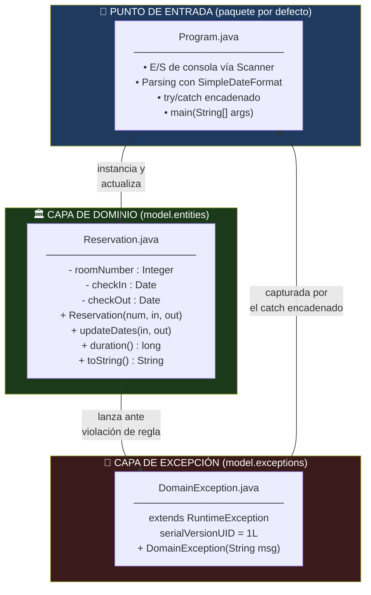
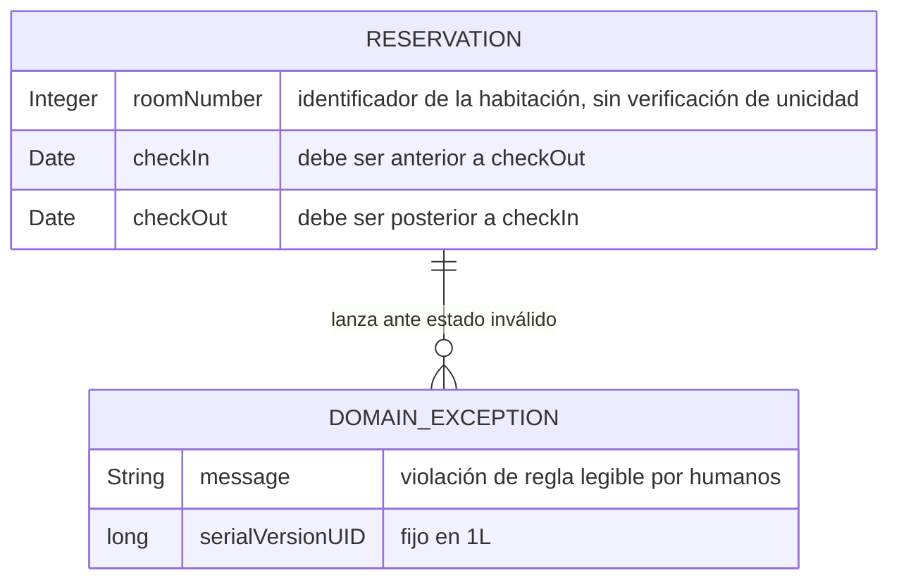
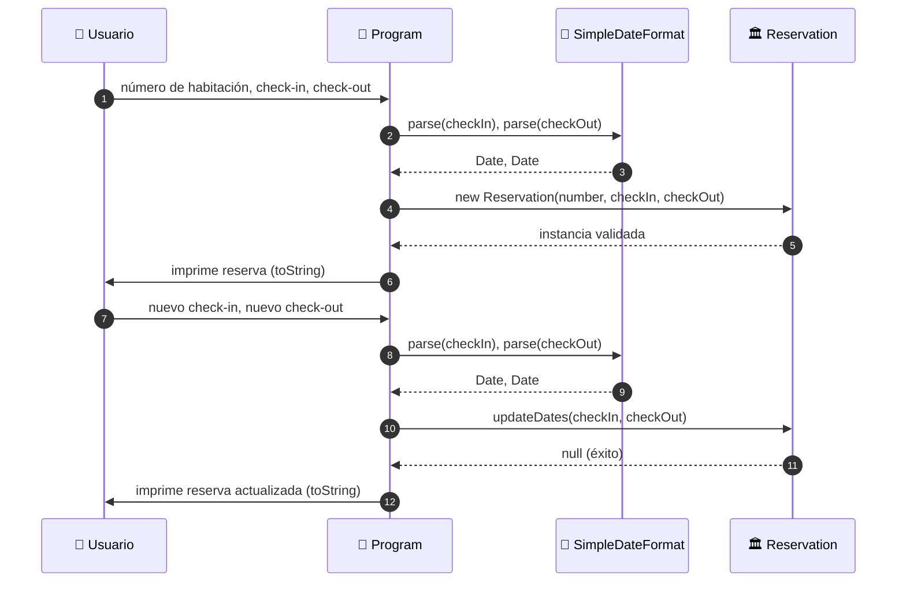
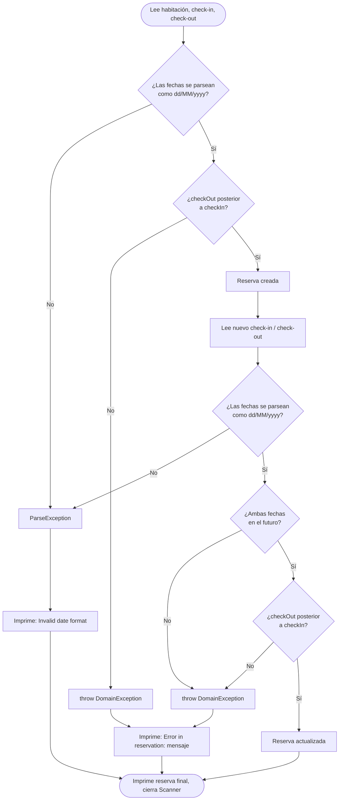
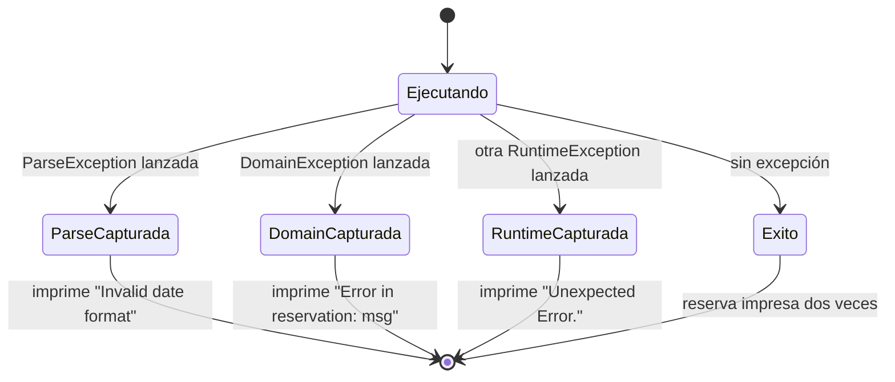
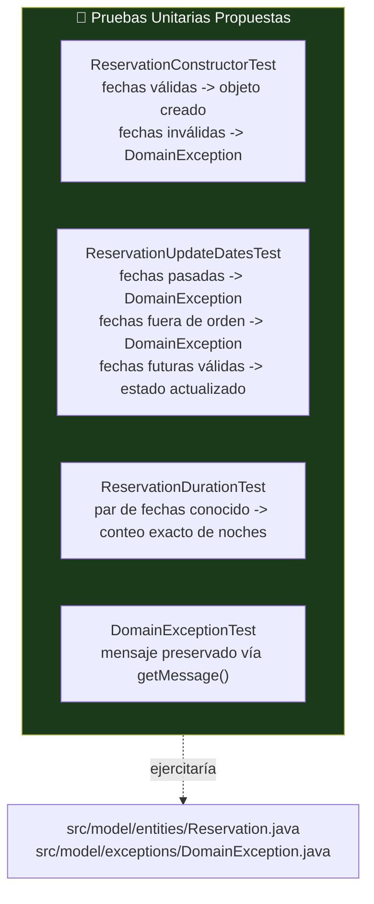

<div align="center">

**🌐 Choose Language / Selecione o Idioma / Elija el Idioma**

[](README.md)&nbsp;&nbsp;&nbsp;[](README_PT.md)&nbsp;&nbsp;&nbsp;[](README_ES.md)

</div>

---

<div align="center">

```
███████╗██╗  ██╗ ██████╗███████╗██████╗ ████████╗██╗ ██████╗ ███████╗
██╔════╝╚██╗██╔╝██╔════╝██╔════╝██╔══██╗╚══██╔══╝██║██╔═══██╗██╔════╝
█████╗   ╚███╔╝ ██║     █████╗  ██████╔╝   ██║   ██║██║   ██║███████╗
██╔══╝   ██╔██╗ ██║     ██╔══╝  ██╔═══╝    ██║   ██║██║   ██║╚════██║
███████╗██╔╝ ██╗╚██████╗███████╗██║        ██║   ██║╚██████╔╝███████║
╚══════╝╚═╝  ╚═╝ ╚═════╝╚══════╝╚═╝        ╚═╝   ╚═╝ ╚═════╝ ╚══════╝
       Manejo de Excepciones en Java — Demo de Reservas de Hotel
```

---


<br/>

> **Un programa Java de consola minimalista y de flujo único que enseña la diferencia entre**
> **excepciones checked y unchecked mediante un modelo de dominio de reserva de hotel y un `try/catch` encadenado.**

<br/>


</div>

---

## 📑 Tabla de Contenidos

<details>
<summary>▶️ <strong>Haga clic para expandir / contraer esta sección</strong></summary>

<table>
<tr>
<td valign="top" width="50%">

**🏗️ Sistema**
- [Visión General](#-visión-general)
- [Arquitectura del Sistema](#️-arquitectura-del-sistema)
- [Stack Tecnológico](#️-stack-tecnológico)
- [Patrones de Diseño Aplicados](#-patrones-de-diseño-aplicados)
- [Estructura del Proyecto](#-estructura-del-proyecto)

**📦 Módulos**
- [Program — Punto de Entrada](#program--punto-de-entrada)
- [Reservation — Entidad de Dominio](#reservation--entidad-de-dominio)
- [DomainException — Excepción Personalizada](#domainexception--excepción-personalizada)

</td>
<td valign="top" width="50%">

**💼 Negocio**
- [Reglas de Negocio](#-reglas-de-negocio)
- [Requisitos Funcionales](#-requisitos-funcionales)
- [Requisitos No Funcionales](#-requisitos-no-funcionales)

**📐 Diseño**
- [Modelo de Datos](#️-modelo-de-datos)
- [Flujos del Sistema](#-flujos-del-sistema)

**🔐 Seguridad & Operación**
- [Seguridad](#-seguridad)
- [Instalación & Ejecución](#-instalación--ejecución)
- [Pruebas Automatizadas](#-pruebas-automatizadas)
- [Métricas & Monitoreo](#-métricas--monitoreo)
- [Limitaciones Conocidas](#️-limitaciones-conocidas)

</td>
</tr>
</table>

---

</details>

## 🌟 Visión General

<details>
<summary>▶️ <strong>Haga clic para expandir / contraer esta sección</strong></summary>

**Exceptios 1** (`exceptios_1_java`) es una aplicación de consola en Java pequeña y deliberadamente minimalista, construida para demostrar el manejo de excepciones como una preocupación de diseño de primer orden y no como un detalle secundario. Todo el programa consiste en tres archivos: un punto de entrada (`Program.java`), una entidad de dominio (`Reservation.java`) y una excepción personalizada en tiempo de ejecución (`DomainException.java`).

El escenario es una reserva de habitación de hotel. Se le solicita al usuario, mediante `Scanner`, un número de habitación y un par de fechas de check-in/check-out, con el formato `dd/MM/yyyy`. Se construye un objeto `Reservation` a partir de esa entrada, se imprime, y luego se solicita nuevamente al usuario que actualice sus fechas. Cada paso que puede fallar está envuelto en un único bloque `try/catch` encadenado en `Program.main()`, y cada fallo de regla de negocio lanzado desde dentro de `Reservation` se manifiesta como una `DomainException` que lleva un mensaje legible por humanos.

No hay capa de persistencia, ni E/S de red, y ninguna herramienta de compilación más allá de Apache Ant, dirigido por los archivos de proyecto de NetBeans (`nbproject/`, `build.xml`). El propósito íntegro del proyecto es pedagógico: mostrar, en la superficie más pequeña posible, la diferencia entre una excepción checked (`java.text.ParseException`), una excepción de dominio personalizada y unchecked (`DomainException extends RuntimeException`), y un respaldo genérico (`RuntimeException`), y mostrar por qué el orden de las cláusulas `catch` importa cuando un tipo de excepción es subclase de otro.

### 🎯 Objetivos del Sistema

| Objetivo | Descripción |
|-----------|-------------|
| 📅 **Capturar Datos de la Reserva** | Leer número de habitación y fechas de check-in/check-out desde la consola mediante `Scanner` |
| 🧾 **Validar en la Construcción** | Rechazar una `Reservation` cuya fecha de check-out no sea posterior a la de check-in |
| 🔁 **Soportar Actualización de Fechas** | Permitir cambiar el par check-in/check-out mediante `updateDates()`, revalidado |
| ⏳ **Exigir Fechas Futuras al Actualizar** | Rechazar una actualización cuyas nuevas fechas no estén ambas en el futuro |
| 🚨 **Señalar Violaciones de Dominio** | Lanzar `DomainException` con un mensaje descriptivo por cada infracción de regla de negocio |
| 🧩 **Demostrar Excepciones Checked** | Manejar `java.text.ParseException` proveniente de `SimpleDateFormat.parse()` |
| 🪜 **Demostrar el Orden de las Cláusulas Catch** | Capturar `DomainException` antes del respaldo más amplio `RuntimeException` |
| 🖨️ **Renderizar un Resumen Legible** | `Reservation.toString()` imprime habitación, fechas y duración calculada en noches |

---

</details>

## 🏗️ Arquitectura del Sistema

<details>
<summary>▶️ <strong>Haga clic para expandir / contraer esta sección</strong></summary>

### Diagrama de Módulos



### Capas de la Arquitectura


El proyecto no tiene una arquitectura por capas en el sentido empresarial; es un único pipeline lineal. Las "capas" anteriores describen el flujo de una sola ejecución: la entrada de consola se convierte en valores `Date` tipados, esos valores construyen o actualizan una `Reservation`, y cualquier violación de regla lanzada por el objeto de dominio se captura de nuevo en el punto de entrada.

---

</details>

## 🛠️ Stack Tecnológico

<details>
<summary>▶️ <strong>Haga clic para expandir / contraer esta sección</strong></summary>

<table>
<tr><th>Capa</th><th>Tecnología</th><th>Versión</th><th>Propósito</th></tr>
<tr><td rowspan="2">Lenguaje & Runtime</td><td>Java (JDK)</td><td>21 (<code>javac.source</code> / <code>javac.target</code>)</td><td>Único lenguaje de implementación de todo el programa</td></tr>
<tr><td>Biblioteca estándar Java SE</td><td>Incluida con el JDK 21</td><td><code>java.util.Scanner</code>, <code>java.util.Date</code>, <code>java.text.SimpleDateFormat</code>, <code>java.text.ParseException</code>, <code>java.util.concurrent.TimeUnit</code></td></tr>
<tr><td rowspan="2">Compilación & Herramientas</td><td>Apache Ant</td><td>Ejecutado vía <code>build.xml</code> + <code>nbproject/build-impl.xml</code></td><td>Compila, empaqueta y ejecuta el proyecto (script de build generado por NetBeans)</td></tr>
<tr><td>Apache NetBeans</td><td>Formato de proyecto en <code>nbproject/</code></td><td>IDE original en la que se creó el proyecto; no es obligatoria para compilar o ejecutar</td></tr>
<tr><td>Empaquetado</td><td>JAR (vía <code>jar.compress=false</code>)</td><td><code>dist/exceptions_1.jar</code></td><td>Artefacto de distribución producido por el objetivo Ant <code>dist</code></td></tr>
<tr><td>Interfaz</td><td>Consola (stdin/stdout)</td><td>n/a</td><td>Toda entrada/salida ocurre vía <code>System.in</code> / <code>System.out</code> a través de <code>Scanner</code></td></tr>
<tr><td>Control de Versiones</td><td>Git</td><td>n/a</td><td>Código alojado en <code>exceptios_1_java</code>, rastreado con un <code>.gitignore</code></td></tr>
</table>

No hay dependencias externas (de terceros). Todo lo que el programa importa (`java.text.*`, `java.util.*`, `java.util.concurrent.TimeUnit`) viene incluido con el JDK.

---

</details>

## 🎨 Patrones de Diseño Aplicados

<details>
<summary>▶️ <strong>Haga clic para expandir / contraer esta sección</strong></summary>

| Patrón | Dónde | Justificación |
|---------|-------|-----------|
| **Tipo de Excepción Personalizado** | `model/exceptions/DomainException.java` | Encapsula fallos de reglas de dominio en un único tipo unchecked, capturable, distinto de las excepciones del JDK |
| **Validación Fail-Fast (Guard Clauses)** | Constructor de `Reservation`, `Reservation.updateDates()` | Ambos métodos validan primero y lanzan (`throw`) inmediatamente antes de mutar el estado, impidiendo que exista un objeto inválido |
| **Encapsulamiento de Invariantes** | `Reservation` | La lógica de validación de fechas vive dentro de la propia entidad, no en `Program`, de modo que la entidad nunca puede construirse o mutarse a un estado inválido a través de su API pública |
| **Jerarquía de Excepciones / Chain of Responsibility (orden del catch)** | Bloque `try/catch` de `Program.main()` | `ParseException` → `DomainException` → `RuntimeException`, de lo más específico a lo más genérico, para que cada fallo se diagnostique en la granularidad correcta |
| **Formateo de Valor vía `toString()`** | `Reservation.toString()` | Centraliza la representación legible de una reserva (habitación, fechas formateadas, duración calculada) en un único método sobrescrito |
| **Formateador Utilitario Estático** | `Reservation.sdf` (`private static SimpleDateFormat`) | Una única instancia compartida de formateador de fecha usada por cada llamada a `toString()` de la clase |
| **Responsabilidad Única por Clase** | `Program` (E/S y flujo de control) vs. `Reservation` (estado y reglas) vs. `DomainException` (señalización de error) | Cada una de las tres clases tiene exactamente un motivo para cambiar |

---

</details>

## 📁 Estructura del Proyecto

<details>
<summary>▶️ <strong>Haga clic para expandir / contraer esta sección</strong></summary>

```
exceptios_1_java/
│
├── 📄 build.xml                        # Punto de entrada del build Apache Ant (delega a nbproject/build-impl.xml)
├── 📄 manifest.mf                      # Stub del manifiesto del JAR; Main-Class inyectado por el build
├── 📄 .gitignore                       # Ignora la salida de build/dist de NetBeans
│
├── 📂 nbproject/                       # Metadatos del proyecto NetBeans
│   ├── 📄 build-impl.xml               # Implementación Ant generada (objetivos compile/run/dist/clean)
│   ├── 📄 genfiles.properties          # Rastrea checksums de archivos generados para NetBeans
│   ├── 📄 project.properties           # Config de build: javac.source/target=21, main.class=Program, ruta de dist.jar
│   ├── 📄 project.xml                  # Declaración del tipo de proyecto NetBeans (java-project-ant)
│   └── 📂 private/                     # 📄 private.properties, 📄 private.xml — estado local del IDE, no portable
│
└── 📂 src/                             # Todo el código fuente Java (src.dir=src)
    ├── 📄 Program.java                 # Punto de entrada — E/S de consola + try/catch encadenado  ← CORE
    │
    └── 📂 model/
        ├── 📂 entities/
        │   └── 📄 Reservation.java     # Entidad de dominio — validación + reglas de negocio  ← CORE
        │
        └── 📂 exceptions/
            └── 📄 DomainException.java # Excepción personalizada unchecked  ← CORE

README.md                               # Este archivo — Inglés (primario)
README_PT.md                            # Português (Brasil)
README_ES.md                            # Español
```

El proyecto no tiene un directorio `test/` poblado con código fuente, ningún paquete de recursos, y ningún archivo de configuración más allá de los metadatos NetBeans/Ant anteriores; `nbproject/project.properties` declara `test.src.dir=test`, pero ese directorio no existe en el repositorio.

---

</details>

## 📦 Módulos del Sistema

<details>
<summary>▶️ <strong>Haga clic para expandir / contraer esta sección</strong></summary>

### Program — Punto de Entrada

`src/Program.java`, paquete por defecto (sin nombre). La única clase con un método `main(String[] args)` y, por lo tanto, la `Main-Class` del JAR (declarada como `main.class=Program` en `nbproject/project.properties`). Es responsable de toda la E/S de consola y orquesta un ciclo completo de "crear luego actualizar" reserva por ejecución.

| Responsabilidad | Detalle |
|-----------------|--------|
| Entrada de consola | Abre un `Scanner` sobre `System.in`; lee número de habitación (`sc.nextInt()`) y dos cadenas de fecha (`sc.next()`) para check-in/check-out |
| Parsing de fecha | Usa `new SimpleDateFormat("dd/MM/yyyy")` y `sdf.parse(String)` para convertir texto en `java.util.Date` |
| Creación de objeto | Construye una `Reservation` a partir de la entrada convertida, la imprime vía `toString()` implícito |
| Actualización de objeto | Vuelve a leer dos cadenas de fecha más y llama a `reservation.updateDates(checkIn, checkOut)`, imprime el resultado |
| Manejo de excepciones | Envuelve todo el flujo en un único bloque `try` con tres cláusulas `catch`, exactamente en este orden: `ParseException`, `DomainException`, `RuntimeException` |
| Liberación de recursos | Llama a `sc.close()` incondicionalmente después del try/catch, fuera de cualquier bloque `finally` |

---

### Reservation — Entidad de Dominio

`src/model/entities/Reservation.java`, paquete `model.entities`. Representa una única reserva de habitación de hotel y es la única clase del proyecto que impone reglas de negocio.

| Miembro | Firma | Comportamiento |
|--------|-----------|----------|
| Campos | `private Integer roomNumber; private Date checkIn; private Date checkOut;` | Estado mutable de instancia |
| Campo estático | `private static SimpleDateFormat sdf` | Formateador `"dd/MM/yyyy"` compartido, usado solo por `toString()` |
| Constructor | `Reservation(Integer roomNumber, Date checkIn, Date checkOut) throws DomainException` | Valida `checkOut.after(checkIn)`; lanza `DomainException` en caso contrario |
| `getRoomNumber()` / `setRoomNumber(Integer)` | Par de acceso | Getter/setter simple, sin validación en el setter |
| `getCheckIn()` / `getCheckOut()` | Accesores de solo lectura | Sin setters públicos correspondientes; las fechas solo cambian vía `updateDates()` |
| `duration()` | `public long duration()` | Calcula noches como `TimeUnit.DAYS.convert(checkOut.getTime() - checkIn.getTime(), TimeUnit.MILLISECONDS)` |
| `updateDates(Date, Date)` | `public String updateDates(Date checkIn, Date checkOut) throws DomainException` | Valida que ambas fechas estén en el futuro y que el check-out siga al check-in, luego muta el estado; **siempre retorna `null`** |
| `toString()` | `@Override public String toString()` | Formatea `"Room {n}, check-in: {d}, check-out: {d}, {n} nights"` |

> **Nota sobre el tipo de retorno de `updateDates()`.** El método se declara para retornar `String`, pero su único `return` es `return null;` tras una actualización exitosa. Quien lo invoque debe leer el nuevo estado de la reserva vía `toString()` o los getters; el valor de retorno no aporta información alguna.

---

### DomainException — Excepción Personalizada

`src/model/exceptions/DomainException.java`, paquete `model.exceptions`. Un tipo de excepción unchecked minimalista, usado exclusivamente para señalar una violación de regla de negocio lanzada dentro de `Reservation`.

| Miembro | Detalle |
|--------|--------|
| Superclase | `extends RuntimeException` (unchecked — sin exigencia de `throws` para quienes no la declaran) |
| `serialVersionUID` | `private static final long serialVersionUID = 1L;` |
| Constructor | `public DomainException(String msg)` — reenvía `msg` a `super(msg)`, recuperable vía `getMessage()` |
| Sitios de instanciación | Exactamente dos, ambos dentro de `Reservation`: el constructor y `updateDates()` |

---

</details>

## 💼 Reglas de Negocio

<details>
<summary>▶️ <strong>Haga clic para expandir / contraer esta sección</strong></summary>

### Creación de Reserva

| # | Regla | Aplicación |
|---|------|-------------|
| RN-01 | La fecha de check-out debe ser estrictamente posterior a la de check-in | Constructor de `Reservation`: `if (!checkOut.after(checkIn)) throw new DomainException("Check-out date must be after check-in date.")` |

### Actualización de Reserva

| # | Regla | Aplicación |
|---|------|-------------|
| RN-02 | Las nuevas fechas de check-in y check-out deben estar ambas en el futuro respecto de "ahora" | `updateDates()`: `if (checkIn.before(now) \|\| checkOut.before(now)) throw new DomainException("Reservation dates for update must be future dates.")` |
| RN-03 | La nueva fecha de check-out debe ser estrictamente posterior a la nueva fecha de check-in | `updateDates()`: `if (!checkOut.after(checkIn)) throw new DomainException("Check-out date must be after check-in date.")` |

### Manejo de Entrada

| # | Regla | Aplicación |
|---|------|-------------|
| RN-04 | Las cadenas de fecha deben coincidir estrictamente con el patrón `dd/MM/yyyy` | `SimpleDateFormat.parse()` lanza `java.text.ParseException` ante cualquier entrada que no cumpla el patrón; capturada en `Program.main()` |
| RN-05 | Cualquier excepción que no sea explícitamente `ParseException` o `DomainException` se trata como inesperada y se reporta de forma genérica | La cláusula final `catch (RuntimeException e)` de `Program.main()` imprime `"Unexpected Error."` sin el mensaje original |

---

</details>

## ✅ Requisitos Funcionales

<details>
<summary>▶️ <strong>Haga clic para expandir / contraer esta sección</strong></summary>

| ID | Requisito | Prioridad | Estado |
|----|-------------|----------|--------|
| RF-01 | El sistema debe solicitar al usuario un número de habitación vía consola | 🔴 Alta | ✅ Implementado |
| RF-02 | El sistema debe solicitar al usuario una fecha de check-in en formato `dd/MM/yyyy` | 🔴 Alta | ✅ Implementado |
| RF-03 | El sistema debe solicitar al usuario una fecha de check-out en formato `dd/MM/yyyy` | 🔴 Alta | ✅ Implementado |
| RF-04 | El sistema debe construir una `Reservation` a partir del número de habitación y las fechas capturadas | 🔴 Alta | ✅ Implementado |
| RF-05 | El sistema debe rechazar la creación de la reserva cuando el check-out no sea posterior al check-in | 🔴 Alta | ✅ Implementado |
| RF-06 | El sistema debe imprimir la reserva recién creada vía `toString()` | 🟡 Media | ✅ Implementado |
| RF-07 | El sistema debe solicitar al usuario un nuevo par de fechas check-in/check-out para actualizar la reserva | 🔴 Alta | ✅ Implementado |
| RF-08 | El sistema debe rechazar una actualización cuando cualquier nueva fecha no esté en el futuro | 🔴 Alta | ✅ Implementado |
| RF-09 | El sistema debe rechazar una actualización cuando el nuevo check-out no sea posterior al nuevo check-in | 🔴 Alta | ✅ Implementado |
| RF-10 | El sistema debe imprimir la reserva actualizada vía `toString()` | 🟡 Media | ✅ Implementado |
| RF-11 | El sistema debe calcular la duración de la reserva en noches completas | 🟡 Media | ✅ Implementado |
| RF-12 | El sistema debe capturar `java.text.ParseException` e imprimir `"Invalid date format"` | 🔴 Alta | ✅ Implementado |
| RF-13 | El sistema debe capturar `DomainException` e imprimir `"Error in reservation: " + mensaje` | 🔴 Alta | ✅ Implementado |
| RF-14 | El sistema debe capturar cualquier otra `RuntimeException` e imprimir `"Unexpected Error."` | 🟡 Media | ✅ Implementado |
| RF-15 | El sistema debe cerrar el recurso `Scanner` antes de finalizar | 🟡 Media | ✅ Implementado |
| RF-16 | El sistema debe exponer `getRoomNumber()`/`setRoomNumber()` para el número de habitación | 🟢 Baja | ✅ Implementado |
| RF-17 | El sistema debe exponer accesores de solo lectura `getCheckIn()`/`getCheckOut()` | 🟢 Baja | ✅ Implementado |
| RF-18 | El sistema debe permitir cambiar el número de habitación sin revalidar las fechas | 🟢 Baja | ⚠️ Parcial *(el setter no realiza ninguna validación)* |
| RF-19 | El sistema debe reportar qué campo específico falló en la validación en una `DomainException` | 🟡 Media | ⬜ Planeado *(los mensajes son a nivel de regla, no de campo)* |
| RF-20 | El sistema debe soportar múltiples reservas en una sola ejecución (p. ej., un bucle o menú) | 🟢 Baja | ⬜ Planeado *(el flujo actual gestiona exactamente una reserva por ejecución)* |

---

</details>

## ⚡ Requisitos No Funcionales

<details>
<summary>▶️ <strong>Haga clic para expandir / contraer esta sección</strong></summary>

| ID | Categoría | Requisito | Objetivo |
|----|----------|-------------|--------|
| RNF-01 | ⚡ Rendimiento | El arranque y la ejecución completa deben terminar en bastante menos de un segundo de CPU | Ningún retraso perceptible para un programa de consola de este tamaño |
| RNF-02 | 🔐 Seguridad | Ninguna cadena provista externamente debe interpretarse como código o ruta de archivo | Solo las lecturas de `Scanner` y el parsing de `SimpleDateFormat` tocan la entrada del usuario; sin reflection, sin `exec` |
| RNF-03 | 🧪 Fiabilidad | Toda excepción checked alcanzable desde `main()` debe capturarse, no propagarse | `ParseException` se captura; el programa nunca termina por una excepción checked no capturada |
| RNF-04 | 🧩 Mantenibilidad | Las reglas de negocio deben residir en la entidad de dominio, no en el punto de entrada | Aplicado por el constructor y `updateDates()` de `Reservation`; `Program` no contiene lógica de validación |
| RNF-05 | 📦 Portabilidad | El programa debe ejecutarse en cualquier plataforma con un JDK compatible | Sin APIs específicas del SO; uso puro de `java.*`/`java.util.concurrent.*` |
| RNF-06 | 🗣️ Usabilidad | Las indicaciones y mensajes de error deben estar en inglés claro y directo | Confirmado en las llamadas `System.out.println` de `Program.java` |
| RNF-07 | 🧵 Concurrencia | El programa debe ser de un solo hilo, sin estado mutable compartido entre hilos | Confirmado; no se usa ningún `Thread`, `Runnable` ni colección concurrente más allá de `TimeUnit` |
| RNF-08 | 📏 Tamaño de Código | La implementación debe permanecer lo bastante pequeña como para leerse por completo en minutos | Tres clases, ~130 líneas en total |
| RNF-09 | 🔁 Determinismo | Dada una entrada de consola idéntica, la salida del programa debe ser idéntica en cada ejecución | Cierto, salvo por la dependencia de `updateDates()` en `new Date()` ("ahora") |
| RNF-10 | 🧯 Aislamiento de Fallos | Una única entrada inválida no debe hacer caer la JVM con un stack trace visible para el usuario final | Las tres cláusulas catch imprimen un mensaje en lugar de dejar propagar la excepción |
| RNF-11 | 🏗️ Buildability | El proyecto debe compilarse con una única invocación de herramienta estándar | `ant` (usando `build.xml`) o "Run Project" de NetBeans |
| RNF-12 | 📖 Legibilidad | Los nombres de clases y métodos deben reflejar directamente su responsabilidad | `Reservation`, `DomainException`, `updateDates()`, `duration()` son autoexplicativos |

---

</details>

## 🗄️ Modelo de Datos

<details>
<summary>▶️ <strong>Haga clic para expandir / contraer esta sección</strong></summary>

El proyecto **no tiene base de datos ni persistencia en archivo**. Todo el estado vive en variables locales dentro de `Program.main()` y en los campos de un único objeto `Reservation` transitorio, descartado cuando la JVM finaliza. El diagrama entidad-relación a continuación modela, por tanto, el **grafo de objetos en memoria** de una ejecución, no un esquema persistido.

### Diagrama Entidad-Relación



### Referencia de Campos en Memoria

| Campo | Tipo | Propietario | Mutabilidad | Restricción |
|-------|------|-------|------------|------------|
| `roomNumber` | `Integer` | `Reservation` | Mutable vía `setRoomNumber()` | Ninguna impuesta |
| `checkIn` | `Date` | `Reservation` | Mutable solo vía `updateDates()` | Debe ser anterior a `checkOut`; debe ser futura al actualizar |
| `checkOut` | `Date` | `Reservation` | Mutable solo vía `updateDates()` | Debe ser posterior a `checkIn`; debe ser futura al actualizar |
| `sdf` (formateador) | `static SimpleDateFormat` | `Reservation` | Compartido, no thread-safe | Patrón fijo en `"dd/MM/yyyy"` |

### Formato de Entrada de Consola

| Indicación | Formato Esperado | Convertido A |
|--------|------------------|-------------|
| `Room number:` | Literal entero | `int` vía `Scanner.nextInt()` |
| `Check-in date (dd/MM/yyyy):` | `dd/MM/yyyy` | `java.util.Date` vía `SimpleDateFormat.parse()` |
| `Check-out date (dd/MM/yyyy):` | `dd/MM/yyyy` | `java.util.Date` vía `SimpleDateFormat.parse()` |

---

</details>

## 🔄 Flujos del Sistema

<details>
<summary>▶️ <strong>Haga clic para expandir / contraer esta sección</strong></summary>

### Secuencia de Ejecución Principal



### Flujo de Decisión de Validación



### Máquina de Estados del Orden de Captura de Excepciones



---

</details>

## 🔐 Seguridad

<details>
<summary>▶️ <strong>Haga clic para expandir / contraer esta sección</strong></summary>

### Controles Implementados

| Control | Implementación | Efecto |
|---------|-----------------|--------|
| Validación de entrada antes de mutar el estado | Guard clauses en el constructor y en `updateDates()` de `Reservation` | Impide que llegue a existir una `Reservation` inválida |
| Mensajes de excepción estructurados | `DomainException` lleva una cadena de mensaje fija, no provista por el usuario | Ninguna entrada cruda del usuario se refleja en la salida de error |
| Sin ejecución dinámica de código | Sin reflection, sin `ProcessBuilder`, sin equivalente a `eval` en ningún lugar del código | Elimina por completo los vectores de inyección |
| Sin E/S externa más allá de stdin/stdout | Sin acceso a archivos, red o base de datos | Nada que autenticar, cifrar o exponer |
| `serialVersionUID` en la excepción | `DomainException.serialVersionUID = 1L` | Evita `InvalidClassException` si la clase llega a serializarse entre versiones de la JVM |
| Jerarquía de catch acotada | `ParseException` → `DomainException` → `RuntimeException`, correctamente ordenada de subclase a superclase | Garantiza que el compilador rechace un error de catch inalcanzable |

### Limitaciones de Seguridad Conocidas

> [!WARNING]
> Este proyecto es un ejercicio didáctico de manejo de excepciones, no una aplicación revisada desde la óptica de seguridad. No debe adaptarse a producción sin los cambios siguientes.

| Limitación | Riesgo | Camino de Mitigación |
|------------|------|------------------|
| Sin límites de tamaño o rango para `roomNumber` | Un entero malformado o manipulado podría representar una habitación sin sentido | Añadir validación explícita de rango en el constructor |
| El catch-all `RuntimeException` engulle el stack trace original | Depurar un error real se vuelve más difícil en producción | Registrar `e` (por ejemplo, vía un framework de logging) antes de imprimir el mensaje genérico |
| `Scanner` no se cierra dentro de un bloque `finally` | Un `throw` antes de que `sc.close()` se ejecute sigue siendo seguro aquí (el close *está* después del try/catch), pero cualquier refactorización futura que agregue un `return` temprano dentro del try filtraría el recurso | Usar try-with-resources: `try (Scanner sc = new Scanner(System.in)) { ... }` |
| Sin capa de autenticación o autorización | Cualquiera con acceso a la consola puede crear/mutar cualquier reserva | Fuera de alcance para una demo de consola de un solo usuario; requeriría una capa de auth real para uso multiusuario |
| El parsing de fecha usa la API legada `java.util.Date`/`SimpleDateFormat` | `SimpleDateFormat` no es thread-safe y `Date` es mutable, ambas fuentes clásicas de errores sutiles | Migrar a `java.time.LocalDate` y `DateTimeFormatter` |
| Ninguna prueba unitaria o de integración protege las reglas de validación | Una refactorización futura podría romper silenciosamente las RN-01 a RN-03 | Añadir una suite JUnit según se describe en la sección Pruebas Automatizadas más abajo |

---

</details>

## 🚀 Instalación & Ejecución

<details>
<summary>▶️ <strong>Haga clic para expandir / contraer esta sección</strong></summary>

### Prerrequisitos

| Requisito | Detalle |
|-------------|--------|
| JDK | Versión 21 o compatible (el proyecto está configurado con `javac.source=21` / `javac.target=21` en `nbproject/project.properties`) |
| Apache Ant | Necesario solo si se compila fuera de un IDE; NetBeans incluye una versión compatible |
| Apache NetBeans | Opcional; recomendado si desea la experiencia del IDE original para el que el proyecto trae metadatos |

### Compilación

```bash
# Opción A — Apache Ant (usa build.xml, que delega a nbproject/build-impl.xml)
ant jar
# Produce dist/exceptions_1.jar según nbproject/project.properties (dist.jar=dist/exceptions_1.jar)

# Opción B — javac directamente, sin necesidad de Ant/NetBeans
cd exceptios_1_java/src
javac -d . model/exceptions/DomainException.java model/entities/Reservation.java Program.java
```

### Ejecución

```bash
# Después de la compilación directa con javac de arriba, ejecute desde src/
java Program

# Después de una compilación con Ant, ejecute el jar empaquetado
java -jar dist/exceptions_1.jar

# O, dentro de Apache NetBeans:
#   File -> Open Project... -> seleccione la carpeta exceptios_1_java -> presione F6 (Run Project)
```

### Objetivos de Ant (de `nbproject/build-impl.xml`, invocados vía `build.xml`)

| Objetivo | Propósito |
|--------|---------|
| `compile` | Compila todo el código fuente bajo `src/` en `build/classes` |
| `jar` | Compila y luego empaqueta las clases junto con `manifest.mf` en `dist/exceptions_1.jar` |
| `run` | Compila y ejecuta directamente `main.class=Program` |
| `clean` | Elimina `build/` y `dist/` |
| `javadoc` | Genera la documentación de la API en `dist/javadoc` |

### Configuración de Compilación (`nbproject/project.properties`)

| Clave | Valor | Significado |
|-----|-------|---------|
| `main.class` | `Program` | Punto de entrada inyectado como `Main-Class` en el manifiesto del JAR |
| `javac.source` / `javac.target` | `21` / `21` | Nivel de lenguaje Java y objetivo de bytecode |
| `src.dir` | `src` | Raíz del código fuente |
| `dist.jar` | `dist/exceptions_1.jar` | Ruta del artefacto empaquetado |
| `jar.compress` | `false` | Entradas del JAR almacenadas sin compresión |
| `source.encoding` | `UTF-8` | Codificación de los archivos fuente |

---

</details>

## 🧪 Pruebas Automatizadas

<details>
<summary>▶️ <strong>Haga clic para expandir / contraer esta sección</strong></summary>

**Actualmente no existen pruebas automatizadas en este repositorio.** `nbproject/project.properties` declara `test.src.dir=test`, pero no existe ningún directorio `test/` en el árbol de código fuente, y ningún framework de pruebas (JUnit, TestNG, etc.) está declarado como dependencia en ningún archivo del proyecto. Toda la verificación hasta la fecha ha sido manual, mediante ejecuciones en consola.

### Arquitectura de Pruebas (Propuesta)



### Archivos de Prueba Reales Presentes en el Repositorio

| Archivo de Prueba | Estado |
|-----------|--------|
| *(ninguno)* | ⬜ No existe ningún archivo de código fuente de prueba bajo `test/` ni en ningún otro lugar del repositorio |

### Ejecutando las Pruebas

```bash
# Ningún objetivo de prueba produce salida significativa hoy, ya que no existen fuentes de prueba.
# El script Ant generado sí expone un objetivo test una vez que se agreguen fuentes:
ant test

# Una configuración propuesta añadiría JUnit 5 al javac.test.classpath
# de nbproject/project.properties y colocaría clases de prueba en un nuevo
# directorio test/ (declarado pero no usado como test.src.dir).
```

### Lista de Verificación de Aceptación Manual

| # | Escenario | Pasos | Salida Esperada |
|---|----------|-------|------------------|
| 1 | Reserva válida | Habitación `101`, check-in `25/12/2025`, check-out `28/12/2025` | Imprime `Room 101, check-in: 25/12/2025, check-out: 28/12/2025, 3 nights` |
| 2 | Check-out antes del check-in | Habitación `202`, check-in `28/12/2025`, check-out `25/12/2025` | Imprime `Error in reservation: Check-out date must be after check-in date.` |
| 3 | Actualización con fechas pasadas | Crear una reserva válida, luego actualizar con fechas de `2020` | Imprime `Error in reservation: Reservation dates for update must be future dates.` |
| 4 | Formato de fecha inválido | Ingresar `data_invalida` para el check-in | Imprime `Invalid date format` |
| 5 | Actualización con fechas futuras válidas | Crear una reserva válida, luego actualizar con un par futuro válido posterior | Imprime la reserva actualizada con las nuevas fechas y noches recalculadas |
| 6 | Número de habitación no numérico | Ingresar una cadena no numérica para el número de habitación | `Scanner.nextInt()` lanza `InputMismatchException`, capturada por la cláusula final `RuntimeException`, imprime `Unexpected Error.` |

---

</details>

## 📊 Métricas & Monitoreo

<details>
<summary>▶️ <strong>Haga clic para expandir / contraer esta sección</strong></summary>

### Métricas del Código

| Métrica | Valor |
|--------|-------|
| Archivos de código fuente Java | 3 (`Program.java`, `Reservation.java`, `DomainException.java`) |
| Paquetes | 2 (`model.entities`, `model.exceptions`) + 1 paquete por defecto |
| Líneas de código aproximadas | ~130 (incluyendo líneas en blanco y llaves) |
| Clases públicas | 3 |
| Tipos de excepción personalizados | 1 (`DomainException`) |
| Tipos de excepción checked manejados | 1 (`java.text.ParseException`) |
| Cláusulas `catch` en `Program.main()` | 3 |
| Dependencias externas en tiempo de ejecución | 0 |
| Archivos de prueba | 0 |

### Señales en Tiempo de Ejecución

No hay framework de logging, endpoint de métricas ni integración de monitoreo en este proyecto; la única "señal" observable en tiempo de ejecución es el texto de `System.out`. La tabla siguiente documenta cada mensaje de consola distinto que el programa puede emitir.

| Señal | Disparador | Salida en Consola |
|--------|---------|-----------------|
| Creación exitosa | `Reservation` construida sin violación | `Reservation: Room {n}, check-in: {d}, check-out: {d}, {n} nights` |
| Actualización exitosa | `updateDates()` finaliza sin violación | `Reservation: Room {n}, check-in: {d}, check-out: {d}, {n} nights` (reimpresa) |
| Fallo de parsing | `SimpleDateFormat.parse()` lanza `ParseException` | `Invalid date format` |
| Violación de regla de dominio | `DomainException` lanzada desde el constructor o `updateDates()` | `Error in reservation: {mensaje}` |
| Fallo inesperado | Cualquier otra `RuntimeException` (p. ej., `InputMismatchException`) | `Unexpected Error.` |

### Comandos de Diagnóstico

```bash
# Cuenta las líneas del código fuente Java
find src -name "*.java" | xargs wc -l

# Lista cada sitio donde se lanza una excepción
grep -rn "throw new DomainException" src

# Lista cada cláusula catch en el punto de entrada
grep -n "catch" src/Program.java

# Verifica que la compilación produzca el jar esperado
ant jar && ls -la dist/exceptions_1.jar
```

### Códigos de Salida / Mensajes Estandarizados

| Código / Mensaje | Significado | Dónde se Emite |
|-----------------|---------|-----------------|
| `Invalid date format` | El texto de consola no pudo parsearse como `dd/MM/yyyy` | `Program.main()`, `catch (ParseException e)` |
| `Error in reservation: {msg}` | Se lanzó una `DomainException` desde `Reservation` | `Program.main()`, `catch (DomainException e)` |
| `Unexpected Error.` | Ocurrió cualquier otra excepción unchecked | `Program.main()`, `catch (RuntimeException e)` |
| Código de salida de la JVM `0` | El programa alcanzó el final de `main()` normalmente, en todas las rutas mostradas arriba | Implícito — no existe ninguna llamada explícita a `System.exit()` en ningún lugar del código |

---

</details>

## ⚠️ Limitaciones Conocidas

<details>
<summary>▶️ <strong>Haga clic para expandir / contraer esta sección</strong></summary>

> [!IMPORTANT]
> Este es un programa de consola educativo, de escenario único. Las limitaciones siguientes son, en su mayoría, simplificaciones intencionales apropiadas para su propósito didáctico, no defectos a corregir con urgencia, con excepción de la ausencia de suite de pruebas.

| Categoría | Problema | Estado |
|----------|-------|--------|
| Pruebas | No existe ninguna prueba automatizada en el repositorio | ⚠️ Abierto |
| Diseño de API | `updateDates()` se declara para retornar `String`, pero siempre retorna `null` | ⚠️ Abierto |
| Validación | `setRoomNumber()` no realiza verificación de límites ni de nulidad | ➕ Intencional (fuera del alcance original) |
| Detalle de error | `DomainException` lleva solo un mensaje, sin código de error ni referencia de campo | ➕ Intencional |
| Concurrencia | La instancia de `SimpleDateFormat` es `static` y compartida, lo cual no es thread-safe bajo uso concurrente | ➕ Intencional (el programa es de un solo hilo) |
| Alcance | El programa soporta exactamente una reserva por ejecución; no hay bucle ni menú para crear varias | ➕ Intencional |
| Gestión de recursos | `Scanner` se cierra después del try/catch en lugar de vía try-with-resources | ⚠️ Abierto |
| Modernidad de API | Usa el par legado `java.util.Date`/`SimpleDateFormat` en lugar de `java.time` | ⚠️ Abierto |
| Persistencia | Sin archivo, base de datos ni repositorio en memoria; el estado se descarta al salir | ➕ Intencional |
| Internacionalización | Todas las indicaciones y mensajes están fijos en inglés | ➕ Intencional |
| Logging | Los fallos se imprimen en `System.out`, no se registran con niveles de severidad | ➕ Intencional |
| Documentación | Solo `DomainException` lleva un bloque de comentario estilo Javadoc; `Program` y `Reservation` no tienen ninguno | ⚠️ Abierto |

> [!TIP]
> La mejora de mayor valor sería añadir una pequeña suite de pruebas JUnit que cubra las guard clauses del constructor y de `updateDates()` de `Reservation` (RN-01 a RN-03). Con cero dependencias externas y tres clases pequeñas, una primera suite de pruebas podría escribirse y pasar en menos de una hora, y protegería todo el valor didáctico del proyecto, el comportamiento de manejo de excepciones, contra regresiones silenciosas.

---

</details>

---

<div align="center">

---

### ⚠️ Exceptios 1

*Programa pequeño, lección completa: valide primero, lance con intención, capture en orden.*


<br/>

```
"Una jerarquía de excepciones es una promesa sobre cómo se entenderá el fallo.
 Ordene sus catches como querría que se le entregara la verdad: lo específico primero."
```

</div>
