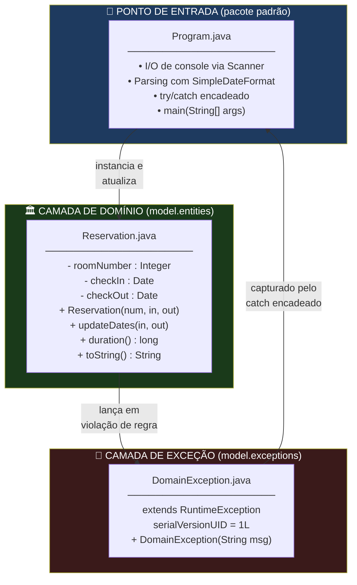
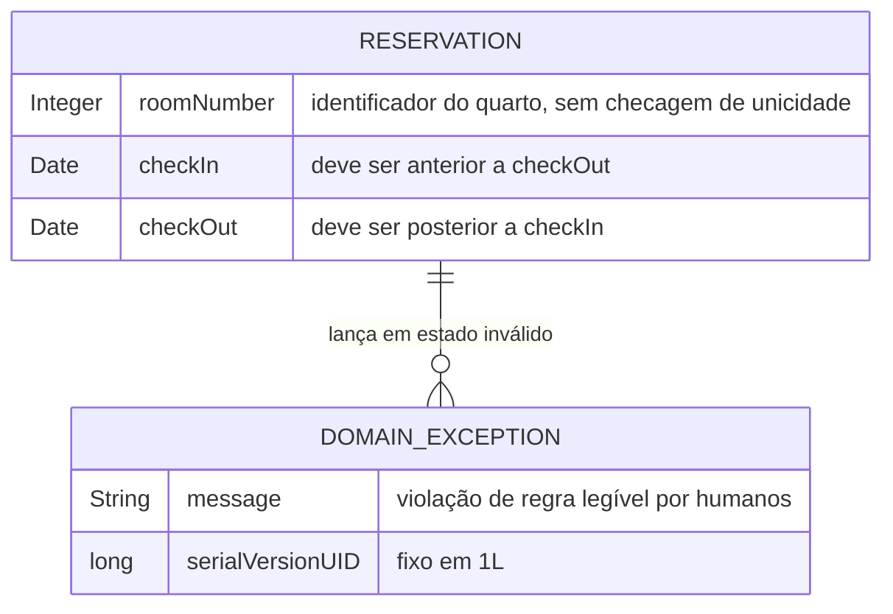
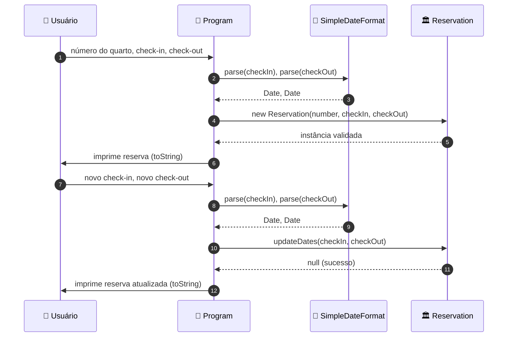
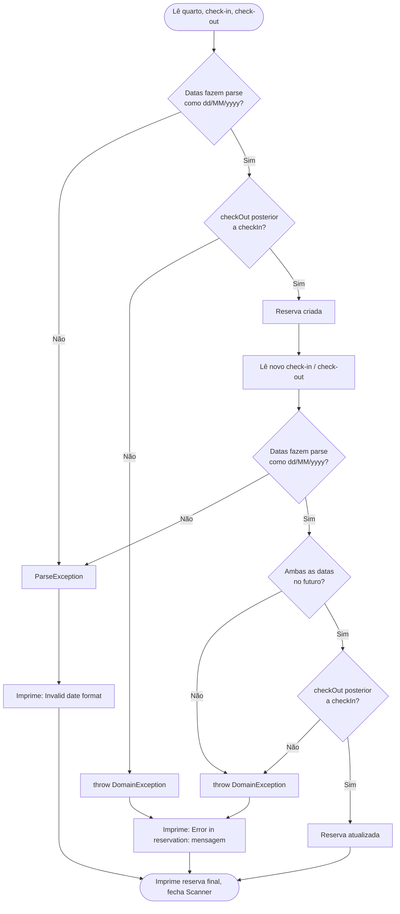
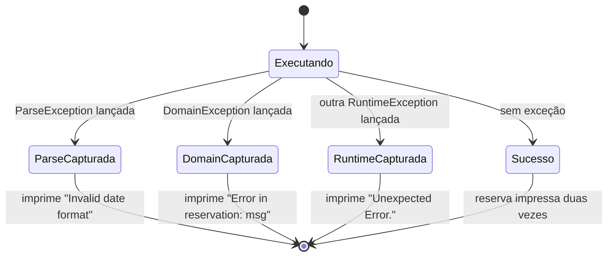
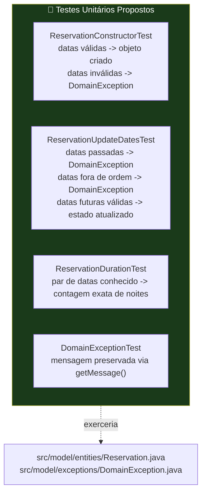

<div align="center">

**🌐 Choose Language / Selecione o Idioma / Elija el Idioma**

[](README.md)&nbsp;&nbsp;&nbsp;[](README_PT.md)&nbsp;&nbsp;&nbsp;[](README_ES.md)

</div>

---

<div align="center">

```
███████╗██╗  ██╗ ██████╗███████╗██████╗ ████████╗██╗ ██████╗ ███████╗
██╔════╝╚██╗██╔╝██╔════╝██╔════╝██╔══██╗╚══██╔══╝██║██╔═══██╗██╔════╝
█████╗   ╚███╔╝ ██║     █████╗  ██████╔╝   ██║   ██║██║   ██║███████╗
██╔══╝   ██╔██╗ ██║     ██╔══╝  ██╔═══╝    ██║   ██║██║   ██║╚════██║
███████╗██╔╝ ██╗╚██████╗███████╗██║        ██║   ██║╚██████╔╝███████║
╚══════╝╚═╝  ╚═╝ ╚═════╝╚══════╝╚═╝        ╚═╝   ╚═╝ ╚═════╝ ╚══════╝
       Tratamento de Exceções em Java — Demo de Reservas de Hotel
```

---


<br/>

> **Um programa Java de console minimalista e de fluxo único que ensina a diferença entre**
> **exceções checked e unchecked através de um modelo de domínio de reserva de hotel e um `try/catch` encadeado.**

<br/>


</div>

---

## 📑 Índice

<details>
<summary>▶️ <strong>Clique para expandir / recolher esta seção</strong></summary>

<table>
<tr>
<td valign="top" width="50%">

**🏗️ Sistema**
- [Visão Geral](#-visão-geral)
- [Arquitetura do Sistema](#️-arquitetura-do-sistema)
- [Stack Tecnológica](#️-stack-tecnológica)
- [Padrões de Projeto Aplicados](#-padrões-de-projeto-aplicados)
- [Estrutura do Projeto](#-estrutura-do-projeto)

**📦 Módulos**
- [Program — Ponto de Entrada](#program--ponto-de-entrada)
- [Reservation — Entidade de Domínio](#reservation--entidade-de-domínio)
- [DomainException — Exceção Customizada](#domainexception--exceção-customizada)

</td>
<td valign="top" width="50%">

**💼 Negócio**
- [Regras de Negócio](#-regras-de-negócio)
- [Requisitos Funcionais](#-requisitos-funcionais)
- [Requisitos Não Funcionais](#-requisitos-não-funcionais)

**📐 Design**
- [Modelo de Dados](#️-modelo-de-dados)
- [Fluxos do Sistema](#-fluxos-do-sistema)

**🔐 Segurança & Operação**
- [Segurança](#-segurança)
- [Instalação & Execução](#-instalação--execução)
- [Testes Automatizados](#-testes-automatizados)
- [Métricas & Monitoramento](#-métricas--monitoramento)
- [Limitações Conhecidas](#️-limitações-conhecidas)

</td>
</tr>
</table>

---

</details>

## 🌟 Visão Geral

<details>
<summary>▶️ <strong>Clique para expandir / recolher esta seção</strong></summary>

**Exceptios 1** (`exceptios_1_java`) é uma pequena aplicação de console em Java, deliberadamente minimalista, construída para demonstrar o tratamento de exceções como uma preocupação de design de primeira classe, não como um detalhe secundário. O programa inteiro é composto por três arquivos: um ponto de entrada (`Program.java`), uma entidade de domínio (`Reservation.java`) e uma exceção customizada em tempo de execução (`DomainException.java`).

O cenário é uma reserva de quarto de hotel. O usuário é solicitado, via `Scanner`, a informar um número de quarto e um par de datas de check-in/check-out, no formato `dd/MM/yyyy`. Um objeto `Reservation` é construído a partir dessa entrada, impresso, e então o usuário é solicitado novamente a atualizar suas datas. Cada etapa que pode falhar está envolvida em um único bloco `try/catch` encadeado em `Program.main()`, e toda falha de regra de negócio lançada de dentro de `Reservation` surge como uma `DomainException` carregando uma mensagem legível por humanos.

Não há camada de persistência, nem I/O de rede, e nenhuma ferramenta de build além do Apache Ant conduzido pelos arquivos de projeto do NetBeans (`nbproject/`, `build.xml`). O propósito inteiro do projeto é pedagógico: mostrar, na menor superfície possível, a diferença entre uma exceção checked (`java.text.ParseException`), uma exceção de domínio customizada e unchecked (`DomainException extends RuntimeException`), e um fallback genérico (`RuntimeException`), além de mostrar por que a ordem das cláusulas `catch` importa quando um tipo de exceção é subclasse de outro.

### 🎯 Objetivos do Sistema

| Objetivo | Descrição |
|-----------|-------------|
| 📅 **Capturar Dados da Reserva** | Ler número do quarto e datas de check-in/check-out do console via `Scanner` |
| 🧾 **Validar na Construção** | Rejeitar uma `Reservation` cuja data de check-out não seja posterior à data de check-in |
| 🔁 **Suportar Atualização de Datas** | Permitir alterar o par check-in/check-out via `updateDates()`, revalidado |
| ⏳ **Exigir Datas Futuras na Atualização** | Rejeitar uma atualização cujas novas datas não estejam ambas no futuro |
| 🚨 **Sinalizar Violações de Domínio** | Lançar `DomainException` com mensagem descritiva para cada violação de regra de negócio |
| 🧩 **Demonstrar Exceções Checked** | Tratar `java.text.ParseException` vinda de `SimpleDateFormat.parse()` |
| 🪜 **Demonstrar Ordem das Cláusulas Catch** | Capturar `DomainException` antes do fallback mais amplo `RuntimeException` |
| 🖨️ **Renderizar um Resumo Legível** | `Reservation.toString()` imprime quarto, datas e duração calculada em noites |

---

</details>

## 🏗️ Arquitetura do Sistema

<details>
<summary>▶️ <strong>Clique para expandir / recolher esta seção</strong></summary>

### Diagrama de Módulos



### Camadas da Arquitetura


O projeto não possui uma arquitetura em camadas no sentido corporativo; trata-se de um único pipeline linear. As "camadas" acima descrevem o fluxo de uma única execução: a entrada de console é convertida em valores `Date` tipados, esses valores constroem ou atualizam uma `Reservation`, e qualquer violação de regra lançada pelo objeto de domínio é capturada de volta no ponto de entrada.

---

</details>

## 🛠️ Stack Tecnológica

<details>
<summary>▶️ <strong>Clique para expandir / recolher esta seção</strong></summary>

<table>
<tr><th>Camada</th><th>Tecnologia</th><th>Versão</th><th>Propósito</th></tr>
<tr><td rowspan="2">Linguagem & Runtime</td><td>Java (JDK)</td><td>21 (<code>javac.source</code> / <code>javac.target</code>)</td><td>Única linguagem de implementação de todo o programa</td></tr>
<tr><td>Biblioteca padrão Java SE</td><td>Distribuída com o JDK 21</td><td><code>java.util.Scanner</code>, <code>java.util.Date</code>, <code>java.text.SimpleDateFormat</code>, <code>java.text.ParseException</code>, <code>java.util.concurrent.TimeUnit</code></td></tr>
<tr><td rowspan="2">Build & Ferramentas</td><td>Apache Ant</td><td>Executado via <code>build.xml</code> + <code>nbproject/build-impl.xml</code></td><td>Compila, empacota e executa o projeto (script de build gerado pelo NetBeans)</td></tr>
<tr><td>Apache NetBeans</td><td>Formato de projeto em <code>nbproject/</code></td><td>IDE original em que o projeto foi criado; não obrigatória para compilar ou executar</td></tr>
<tr><td>Empacotamento</td><td>JAR (via <code>jar.compress=false</code>)</td><td><code>dist/exceptions_1.jar</code></td><td>Artefato de distribuição produzido pelo alvo Ant <code>dist</code></td></tr>
<tr><td>Interface</td><td>Console (stdin/stdout)</td><td>n/a</td><td>Toda entrada/saída acontece via <code>System.in</code> / <code>System.out</code> através de <code>Scanner</code></td></tr>
<tr><td>Controle de Versão</td><td>Git</td><td>n/a</td><td>Código hospedado em <code>exceptios_1_java</code>, rastreado com um <code>.gitignore</code></td></tr>
</table>

Não há dependências externas (de terceiros). Tudo que o programa importa (`java.text.*`, `java.util.*`, `java.util.concurrent.TimeUnit`) já vem com o JDK.

---

</details>

## 🎨 Padrões de Projeto Aplicados

<details>
<summary>▶️ <strong>Clique para expandir / recolher esta seção</strong></summary>

| Padrão | Onde | Justificativa |
|---------|-------|-----------|
| **Tipo de Exceção Customizado** | `model/exceptions/DomainException.java` | Encapsula falhas de regras de domínio em um único tipo unchecked, capturável, distinto das exceções do JDK |
| **Validação Fail-Fast (Guard Clauses)** | Construtor de `Reservation`, `Reservation.updateDates()` | Ambos os métodos validam primeiro e lançam (`throw`) imediatamente antes de alterar o estado, impedindo que um objeto inválido exista |
| **Encapsulamento de Invariantes** | `Reservation` | A lógica de validação de datas vive dentro da própria entidade, não em `Program`, então a entidade nunca pode ser construída ou alterada para um estado inválido via sua API pública |
| **Hierarquia de Exceções / Chain of Responsibility (ordem do catch)** | Bloco `try/catch` de `Program.main()` | `ParseException` → `DomainException` → `RuntimeException`, do mais específico ao mais genérico, para que cada falha seja diagnosticada na granularidade correta |
| **Formatação de Valor via `toString()`** | `Reservation.toString()` | Centraliza a renderização legível de uma reserva (quarto, datas formatadas, duração calculada) em um único método sobrescrito |
| **Formatador Utilitário Estático** | `Reservation.sdf` (`private static SimpleDateFormat`) | Uma única instância compartilhada de formatador de data usada por toda chamada a `toString()` da classe |
| **Responsabilidade Única por Classe** | `Program` (I/O e fluxo de controle) vs. `Reservation` (estado e regras) vs. `DomainException` (sinalização de erro) | Cada uma das três classes tem exatamente um motivo para mudar |

---

</details>

## 📁 Estrutura do Projeto

<details>
<summary>▶️ <strong>Clique para expandir / recolher esta seção</strong></summary>

```
exceptios_1_java/
│
├── 📄 build.xml                        # Ponto de entrada do build Apache Ant (delega a nbproject/build-impl.xml)
├── 📄 manifest.mf                      # Stub do manifesto do JAR; Main-Class injetado pelo build
├── 📄 .gitignore                       # Ignora saída de build/dist do NetBeans
│
├── 📂 nbproject/                       # Metadados do projeto NetBeans
│   ├── 📄 build-impl.xml               # Implementação Ant gerada (alvos compile/run/dist/clean)
│   ├── 📄 genfiles.properties          # Rastreia checksums de arquivos gerados para o NetBeans
│   ├── 📄 project.properties           # Config de build: javac.source/target=21, main.class=Program, caminho do dist.jar
│   ├── 📄 project.xml                  # Declaração do tipo de projeto NetBeans (java-project-ant)
│   └── 📂 private/                     # 📄 private.properties, 📄 private.xml — estado local da IDE, não portável
│
└── 📂 src/                             # Todo o código-fonte Java (src.dir=src)
    ├── 📄 Program.java                 # Ponto de entrada — I/O de console + try/catch encadeado  ← CORE
    │
    └── 📂 model/
        ├── 📂 entities/
        │   └── 📄 Reservation.java     # Entidade de domínio — validação + regras de negócio  ← CORE
        │
        └── 📂 exceptions/
            └── 📄 DomainException.java # Exceção customizada unchecked  ← CORE

README.md                               # Este arquivo — Inglês (primário)
README_PT.md                            # Português (Brasil)
README_ES.md                            # Español
```

O projeto não possui um diretório `test/` populado com código-fonte, nenhum pacote de recursos, e nenhum arquivo de configuração além dos metadados NetBeans/Ant acima; `nbproject/project.properties` declara `test.src.dir=test`, mas esse diretório não existe no repositório.

---

</details>

## 📦 Módulos do Sistema

<details>
<summary>▶️ <strong>Clique para expandir / recolher esta seção</strong></summary>

### Program — Ponto de Entrada

`src/Program.java`, pacote padrão (sem nome). A única classe com um método `main(String[] args)` e, portanto, a `Main-Class` do JAR (declarada como `main.class=Program` em `nbproject/project.properties`). Ela é responsável por todo o I/O de console e orquestra um ciclo completo de "criar então atualizar" reserva por execução.

| Responsabilidade | Detalhe |
|-----------------|--------|
| Entrada de console | Abre um `Scanner` sobre `System.in`; lê número do quarto (`sc.nextInt()`) e duas strings de data (`sc.next()`) para check-in/check-out |
| Parsing de data | Usa `new SimpleDateFormat("dd/MM/yyyy")` e `sdf.parse(String)` para converter texto em `java.util.Date` |
| Criação de objeto | Constrói uma `Reservation` a partir da entrada convertida e imprime via `toString()` implícito |
| Atualização de objeto | Lê mais duas strings de data e chama `reservation.updateDates(checkIn, checkOut)`, imprimindo o resultado |
| Tratamento de exceção | Envolve todo o fluxo em um único bloco `try` com três cláusulas `catch`, exatamente nesta ordem: `ParseException`, `DomainException`, `RuntimeException` |
| Liberação de recurso | Chama `sc.close()` incondicionalmente após o try/catch, fora de qualquer bloco `finally` |

---

### Reservation — Entidade de Domínio

`src/model/entities/Reservation.java`, pacote `model.entities`. Representa uma única reserva de quarto de hotel e é a única classe do projeto que impõe regras de negócio.

| Membro | Assinatura | Comportamento |
|--------|-----------|----------|
| Campos | `private Integer roomNumber; private Date checkIn; private Date checkOut;` | Estado mutável de instância |
| Campo estático | `private static SimpleDateFormat sdf` | Formatador `"dd/MM/yyyy"` compartilhado, usado apenas por `toString()` |
| Construtor | `Reservation(Integer roomNumber, Date checkIn, Date checkOut) throws DomainException` | Valida `checkOut.after(checkIn)`; lança `DomainException` caso contrário |
| `getRoomNumber()` / `setRoomNumber(Integer)` | Par de acesso | Getter/setter simples, sem validação no setter |
| `getCheckIn()` / `getCheckOut()` | Acessores somente leitura | Sem setters públicos correspondentes; as datas só mudam via `updateDates()` |
| `duration()` | `public long duration()` | Calcula noites como `TimeUnit.DAYS.convert(checkOut.getTime() - checkIn.getTime(), TimeUnit.MILLISECONDS)` |
| `updateDates(Date, Date)` | `public String updateDates(Date checkIn, Date checkOut) throws DomainException` | Valida que ambas as datas estão no futuro e que o check-out segue o check-in, então altera o estado; **sempre retorna `null`** |
| `toString()` | `@Override public String toString()` | Formata `"Room {n}, check-in: {d}, check-out: {d}, {n} nights"` |

> **Nota sobre o tipo de retorno de `updateDates()`.** O método é declarado para retornar `String`, mas seu único `return` é `return null;` após uma atualização bem-sucedida. Quem chama o método deve ler o novo estado da reserva via `toString()` ou os getters; o valor de retorno não carrega informação alguma.

---

### DomainException — Exceção Customizada

`src/model/exceptions/DomainException.java`, pacote `model.exceptions`. Um tipo de exceção unchecked minimalista, usado exclusivamente para sinalizar uma violação de regra de negócio lançada dentro de `Reservation`.

| Membro | Detalhe |
|--------|--------|
| Superclasse | `extends RuntimeException` (unchecked — sem exigência de `throws` para quem chama sem declarar) |
| `serialVersionUID` | `private static final long serialVersionUID = 1L;` |
| Construtor | `public DomainException(String msg)` — repassa `msg` para `super(msg)`, recuperável via `getMessage()` |
| Locais de instanciação | Exatamente dois, ambos dentro de `Reservation`: o construtor e `updateDates()` |

---

</details>

## 💼 Regras de Negócio

<details>
<summary>▶️ <strong>Clique para expandir / recolher esta seção</strong></summary>

### Criação de Reserva

| # | Regra | Aplicação |
|---|------|-------------|
| RN-01 | A data de check-out deve ser estritamente posterior à data de check-in | Construtor de `Reservation`: `if (!checkOut.after(checkIn)) throw new DomainException("Check-out date must be after check-in date.")` |

### Atualização de Reserva

| # | Regra | Aplicação |
|---|------|-------------|
| RN-02 | As novas datas de check-in e check-out devem estar ambas no futuro em relação a "agora" | `updateDates()`: `if (checkIn.before(now) \|\| checkOut.before(now)) throw new DomainException("Reservation dates for update must be future dates.")` |
| RN-03 | A nova data de check-out deve ser estritamente posterior à nova data de check-in | `updateDates()`: `if (!checkOut.after(checkIn)) throw new DomainException("Check-out date must be after check-in date.")` |

### Tratamento de Entrada

| # | Regra | Aplicação |
|---|------|-------------|
| RN-04 | As strings de data devem corresponder estritamente ao padrão `dd/MM/yyyy` | `SimpleDateFormat.parse()` lança `java.text.ParseException` para qualquer entrada fora do padrão; capturado em `Program.main()` |
| RN-05 | Qualquer exceção que não seja explicitamente `ParseException` ou `DomainException` é tratada como inesperada e reportada genericamente | A cláusula final `catch (RuntimeException e)` de `Program.main()` imprime `"Unexpected Error."` sem a mensagem original |

---

</details>

## ✅ Requisitos Funcionais

<details>
<summary>▶️ <strong>Clique para expandir / recolher esta seção</strong></summary>

| ID | Requisito | Prioridade | Status |
|----|-------------|----------|--------|
| RF-01 | O sistema deve solicitar ao usuário um número de quarto via console | 🔴 Alta | ✅ Implementado |
| RF-02 | O sistema deve solicitar ao usuário uma data de check-in no formato `dd/MM/yyyy` | 🔴 Alta | ✅ Implementado |
| RF-03 | O sistema deve solicitar ao usuário uma data de check-out no formato `dd/MM/yyyy` | 🔴 Alta | ✅ Implementado |
| RF-04 | O sistema deve construir uma `Reservation` a partir do número do quarto e datas capturados | 🔴 Alta | ✅ Implementado |
| RF-05 | O sistema deve rejeitar a criação da reserva quando o check-out não for posterior ao check-in | 🔴 Alta | ✅ Implementado |
| RF-06 | O sistema deve imprimir a reserva recém-criada via `toString()` | 🟡 Média | ✅ Implementado |
| RF-07 | O sistema deve solicitar ao usuário um novo par de datas check-in/check-out para atualizar a reserva | 🔴 Alta | ✅ Implementado |
| RF-08 | O sistema deve rejeitar uma atualização quando qualquer nova data não estiver no futuro | 🔴 Alta | ✅ Implementado |
| RF-09 | O sistema deve rejeitar uma atualização quando o novo check-out não for posterior ao novo check-in | 🔴 Alta | ✅ Implementado |
| RF-10 | O sistema deve imprimir a reserva atualizada via `toString()` | 🟡 Média | ✅ Implementado |
| RF-11 | O sistema deve calcular a duração da reserva em noites inteiras | 🟡 Média | ✅ Implementado |
| RF-12 | O sistema deve capturar `java.text.ParseException` e imprimir `"Invalid date format"` | 🔴 Alta | ✅ Implementado |
| RF-13 | O sistema deve capturar `DomainException` e imprimir `"Error in reservation: " + mensagem` | 🔴 Alta | ✅ Implementado |
| RF-14 | O sistema deve capturar qualquer outra `RuntimeException` e imprimir `"Unexpected Error."` | 🟡 Média | ✅ Implementado |
| RF-15 | O sistema deve fechar o recurso `Scanner` antes de terminar | 🟡 Média | ✅ Implementado |
| RF-16 | O sistema deve expor `getRoomNumber()`/`setRoomNumber()` para o número do quarto | 🟢 Baixa | ✅ Implementado |
| RF-17 | O sistema deve expor acessores somente leitura `getCheckIn()`/`getCheckOut()` | 🟢 Baixa | ✅ Implementado |
| RF-18 | O sistema deve permitir alterar o número do quarto sem revalidar as datas | 🟢 Baixa | ⚠️ Parcial *(o setter não realiza nenhuma validação)* |
| RF-19 | O sistema deve reportar qual campo específico falhou na validação em uma `DomainException` | 🟡 Média | ⬜ Planejado *(mensagens são no nível de regra, não de campo)* |
| RF-20 | O sistema deve suportar múltiplas reservas em uma única execução (ex.: laço ou menu) | 🟢 Baixa | ⬜ Planejado *(o fluxo atual trata exatamente uma reserva por execução)* |

---

</details>

## ⚡ Requisitos Não Funcionais

<details>
<summary>▶️ <strong>Clique para expandir / recolher esta seção</strong></summary>

| ID | Categoria | Requisito | Alvo |
|----|----------|-------------|--------|
| RNF-01 | ⚡ Performance | A inicialização e execução completa devem terminar em bem menos de um segundo de CPU | Nenhum atraso perceptível para um programa de console deste tamanho |
| RNF-02 | 🔐 Segurança | Nenhuma string fornecida externamente deve ser interpretada como código ou caminho de arquivo | Apenas leituras de `Scanner` e o parsing de `SimpleDateFormat` tocam a entrada do usuário; sem reflection, sem `exec` |
| RNF-03 | 🧪 Confiabilidade | Toda exceção checked alcançável a partir de `main()` deve ser capturada, não propagada | `ParseException` é capturada; o programa nunca termina por uma exceção checked não capturada |
| RNF-04 | 🧩 Manutenibilidade | As regras de negócio devem viver na entidade de domínio, não no ponto de entrada | Aplicado pelo construtor e `updateDates()` de `Reservation`; `Program` não contém lógica de validação |
| RNF-05 | 📦 Portabilidade | O programa deve rodar em qualquer plataforma com um JDK compatível | Nenhuma API específica de SO; uso puro de `java.*`/`java.util.concurrent.*` |
| RNF-06 | 🗣️ Usabilidade | Prompts e mensagens de erro devem estar em inglês claro e direto | Confirmado nas chamadas `System.out.println` de `Program.java` |
| RNF-07 | 🧵 Concorrência | O programa deve ser single-threaded, sem estado mutável compartilhado entre threads | Confirmado; nenhum `Thread`, `Runnable` ou coleção concorrente é usado além de `TimeUnit` |
| RNF-08 | 📏 Tamanho de Código | A implementação deve permanecer pequena o bastante para ser lida por completo em minutos | Três classes, ~130 linhas no total |
| RNF-09 | 🔁 Determinismo | Dada entrada de console idêntica, a saída do programa deve ser idêntica a cada execução | Verdadeiro, exceto pela dependência de `updateDates()` em `new Date()` ("agora") |
| RNF-10 | 🧯 Isolamento de Falhas | Uma única entrada inválida não deve derrubar a JVM com um stack trace visível ao usuário final | As três cláusulas catch imprimem uma mensagem em vez de deixar a exceção se propagar |
| RNF-11 | 🏗️ Buildability | O projeto deve compilar com uma única invocação de ferramenta padrão | `ant` (usando `build.xml`) ou "Run Project" do NetBeans |
| RNF-12 | 📖 Legibilidade | Nomes de classes e métodos devem refletir diretamente sua responsabilidade | `Reservation`, `DomainException`, `updateDates()`, `duration()` são autoexplicativos |

---

</details>

## 🗄️ Modelo de Dados

<details>
<summary>▶️ <strong>Clique para expandir / recolher esta seção</strong></summary>

O projeto **não possui banco de dados nem persistência em arquivo**. Todo o estado vive em variáveis locais dentro de `Program.main()` e nos campos de um único objeto `Reservation` transiente, descartado quando a JVM encerra. O diagrama entidade-relacionamento abaixo, portanto, modela o **grafo de objetos em memória** de uma execução, não um esquema persistido.

### Diagrama Entidade-Relacionamento



### Referência de Campos em Memória

| Campo | Tipo | Dono | Mutabilidade | Restrição |
|-------|------|-------|------------|------------|
| `roomNumber` | `Integer` | `Reservation` | Mutável via `setRoomNumber()` | Nenhuma imposta |
| `checkIn` | `Date` | `Reservation` | Mutável apenas via `updateDates()` | Deve ser anterior a `checkOut`; deve ser futura na atualização |
| `checkOut` | `Date` | `Reservation` | Mutável apenas via `updateDates()` | Deve ser posterior a `checkIn`; deve ser futura na atualização |
| `sdf` (formatador) | `static SimpleDateFormat` | `Reservation` | Compartilhado, não thread-safe | Padrão fixo em `"dd/MM/yyyy"` |

### Formato de Entrada de Console

| Prompt | Formato Esperado | Convertido Para |
|--------|------------------|-------------|
| `Room number:` | Literal inteiro | `int` via `Scanner.nextInt()` |
| `Check-in date (dd/MM/yyyy):` | `dd/MM/yyyy` | `java.util.Date` via `SimpleDateFormat.parse()` |
| `Check-out date (dd/MM/yyyy):` | `dd/MM/yyyy` | `java.util.Date` via `SimpleDateFormat.parse()` |

---

</details>

## 🔄 Fluxos do Sistema

<details>
<summary>▶️ <strong>Clique para expandir / recolher esta seção</strong></summary>

### Sequência de Execução Principal



### Fluxo de Decisão de Validação



### Máquina de Estados da Ordem de Captura de Exceções



---

</details>

## 🔐 Segurança

<details>
<summary>▶️ <strong>Clique para expandir / recolher esta seção</strong></summary>

### Controles Implementados

| Controle | Implementação | Efeito |
|---------|-----------------|--------|
| Validação de entrada antes da alteração de estado | Guard clauses no construtor e em `updateDates()` de `Reservation` | Impede que uma `Reservation` inválida chegue a existir |
| Mensagens de exceção estruturadas | `DomainException` carrega uma string de mensagem fixa, não fornecida pelo usuário | Nenhuma entrada bruta do usuário é ecoada de volta na saída de erro |
| Sem execução dinâmica de código | Sem reflection, sem `ProcessBuilder`, sem equivalente a `eval` em nenhum lugar do código | Elimina vetores de injeção por completo |
| Sem I/O externo além de stdin/stdout | Sem acesso a arquivo, rede ou banco de dados | Nada a autenticar, criptografar ou expor |
| `serialVersionUID` na exceção | `DomainException.serialVersionUID = 1L` | Evita `InvalidClassException` caso a classe seja serializada entre versões da JVM |
| Hierarquia de catch delimitada | `ParseException` → `DomainException` → `RuntimeException`, corretamente ordenada da subclasse para a superclasse | Garante que o compilador rejeite um erro de catch inalcançável |

### Limitações de Segurança Conhecidas

> [!WARNING]
> Este projeto é um exercício didático de tratamento de exceções, não uma aplicação revisada sob a ótica de segurança. Não deve ser adaptado para produção sem as mudanças abaixo.

| Limitação | Risco | Caminho de Mitigação |
|------------|------|------------------|
| Sem limites de tamanho ou faixa para `roomNumber` | Um inteiro malformado ou forjado pode representar um quarto sem sentido | Adicionar validação explícita de faixa no construtor |
| O catch-all `RuntimeException` engole o stack trace original | Depurar um bug real fica mais difícil em produção | Registrar `e` (por exemplo, via um framework de logging) antes de imprimir a mensagem genérica |
| `Scanner` não é fechado em um bloco `finally` | Um `throw` antes de `sc.close()` executar ainda é seguro aqui (o close *está* após o try/catch), mas qualquer refatoração futura que adicione um `return` antecipado dentro do try vazaria o recurso | Usar try-with-resources: `try (Scanner sc = new Scanner(System.in)) { ... }` |
| Nenhuma camada de autenticação ou autorização | Qualquer pessoa com acesso ao console pode criar/alterar qualquer reserva | Fora de escopo para uma demo de console single-user; precisaria de uma camada de auth real para uso multiusuário |
| O parsing de data usa a API legada `java.util.Date`/`SimpleDateFormat` | `SimpleDateFormat` não é thread-safe e `Date` é mutável, ambas fontes clássicas de bugs sutis | Migrar para `java.time.LocalDate` e `DateTimeFormatter` |
| Nenhum teste unitário ou de integração protegendo as regras de validação | Uma refatoração futura poderia quebrar silenciosamente as RN-01 a RN-03 | Adicionar uma suíte JUnit conforme descrito na seção Testes Automatizados abaixo |

---

</details>

## 🚀 Instalação & Execução

<details>
<summary>▶️ <strong>Clique para expandir / recolher esta seção</strong></summary>

### Pré-requisitos

| Requisito | Detalhe |
|-------------|--------|
| JDK | Versão 21 ou compatível (o projeto está configurado com `javac.source=21` / `javac.target=21` em `nbproject/project.properties`) |
| Apache Ant | Necessário apenas se compilando fora de uma IDE; o NetBeans já traz uma versão compatível |
| Apache NetBeans | Opcional; recomendado caso queira a experiência da IDE original para a qual o projeto traz metadados |

### Build

```bash
# Opção A — Apache Ant (usa build.xml, que delega a nbproject/build-impl.xml)
ant jar
# Produz dist/exceptions_1.jar conforme nbproject/project.properties (dist.jar=dist/exceptions_1.jar)

# Opção B — javac diretamente, sem necessidade de Ant/NetBeans
cd exceptios_1_java/src
javac -d . model/exceptions/DomainException.java model/entities/Reservation.java Program.java
```

### Execução

```bash
# Após o build direto com javac acima, execute a partir de src/
java Program

# Após um build com Ant, execute o jar empacotado
java -jar dist/exceptions_1.jar

# Ou, dentro do Apache NetBeans:
#   File -> Open Project... -> selecione a pasta exceptios_1_java -> pressione F6 (Run Project)
```

### Alvos do Ant (de `nbproject/build-impl.xml`, invocados via `build.xml`)

| Alvo | Propósito |
|--------|---------|
| `compile` | Compila todo o código-fonte sob `src/` em `build/classes` |
| `jar` | Compila e então empacota classes mais `manifest.mf` em `dist/exceptions_1.jar` |
| `run` | Compila e executa `main.class=Program` diretamente |
| `clean` | Remove `build/` e `dist/` |
| `javadoc` | Gera documentação da API em `dist/javadoc` |

### Configuração de Build (`nbproject/project.properties`)

| Chave | Valor | Significado |
|-----|-------|---------|
| `main.class` | `Program` | Ponto de entrada injetado como `Main-Class` no manifesto do JAR |
| `javac.source` / `javac.target` | `21` / `21` | Nível de linguagem Java e alvo de bytecode |
| `src.dir` | `src` | Raiz do código-fonte |
| `dist.jar` | `dist/exceptions_1.jar` | Caminho do artefato empacotado |
| `jar.compress` | `false` | Entradas do JAR armazenadas sem compressão |
| `source.encoding` | `UTF-8` | Codificação dos arquivos-fonte |

---

</details>

## 🧪 Testes Automatizados

<details>
<summary>▶️ <strong>Clique para expandir / recolher esta seção</strong></summary>

**Atualmente não existem testes automatizados neste repositório.** `nbproject/project.properties` declara `test.src.dir=test`, mas nenhum diretório `test/` existe na árvore de código-fonte, e nenhum framework de testes (JUnit, TestNG etc.) é declarado como dependência em nenhum arquivo do projeto. Toda a verificação até o momento foi manual, via execuções no console.

### Arquitetura de Testes (Proposta)



### Arquivos de Teste Reais Presentes no Repositório

| Arquivo de Teste | Status |
|-----------|--------|
| *(nenhum)* | ⬜ Nenhum arquivo de código-fonte de teste existe sob `test/` ou em qualquer outro lugar do repositório |

### Executando os Testes

```bash
# Nenhum alvo de teste produz saída significativa hoje, pois não há fontes de teste.
# O script Ant gerado expõe um alvo test assim que fontes forem adicionadas:
ant test

# Uma configuração proposta adicionaria JUnit 5 ao javac.test.classpath
# de nbproject/project.properties e colocaria classes de teste em um novo
# diretório test/ (declarado mas não utilizado como test.src.dir).
```

### Checklist de Aceitação Manual

| # | Cenário | Passos | Saída Esperada |
|---|----------|-------|------------------|
| 1 | Reserva válida | Quarto `101`, check-in `25/12/2025`, check-out `28/12/2025` | Imprime `Room 101, check-in: 25/12/2025, check-out: 28/12/2025, 3 nights` |
| 2 | Check-out antes do check-in | Quarto `202`, check-in `28/12/2025`, check-out `25/12/2025` | Imprime `Error in reservation: Check-out date must be after check-in date.` |
| 3 | Atualização com datas passadas | Criar uma reserva válida, depois atualizar com datas de `2020` | Imprime `Error in reservation: Reservation dates for update must be future dates.` |
| 4 | Formato de data inválido | Digitar `data_invalida` no check-in | Imprime `Invalid date format` |
| 5 | Atualização com datas futuras válidas | Criar uma reserva válida, depois atualizar com um par futuro válido posterior | Imprime a reserva atualizada com as novas datas e noites recalculadas |
| 6 | Número de quarto não numérico | Digitar uma string não numérica para o número do quarto | `Scanner.nextInt()` lança `InputMismatchException`, capturada pela cláusula final `RuntimeException`, imprime `Unexpected Error.` |

---

</details>

## 📊 Métricas & Monitoramento

<details>
<summary>▶️ <strong>Clique para expandir / recolher esta seção</strong></summary>

### Métricas do Código

| Métrica | Valor |
|--------|-------|
| Arquivos de código-fonte Java | 3 (`Program.java`, `Reservation.java`, `DomainException.java`) |
| Pacotes | 2 (`model.entities`, `model.exceptions`) + 1 pacote padrão |
| Linhas de código aproximadas | ~130 (incluindo linhas em branco e chaves) |
| Classes públicas | 3 |
| Tipos de exceção customizados | 1 (`DomainException`) |
| Tipos de exceção checked tratados | 1 (`java.text.ParseException`) |
| Cláusulas `catch` em `Program.main()` | 3 |
| Dependências externas em runtime | 0 |
| Arquivos de teste | 0 |

### Sinais em Runtime

Não há framework de logging, endpoint de métricas ou integração de monitoramento neste projeto; o único "sinal" observável em runtime é o texto de `System.out`. A tabela abaixo documenta cada mensagem de console distinta que o programa pode emitir.

| Sinal | Gatilho | Saída no Console |
|--------|---------|-----------------|
| Criação bem-sucedida | `Reservation` construída sem violação | `Reservation: Room {n}, check-in: {d}, check-out: {d}, {n} nights` |
| Atualização bem-sucedida | `updateDates()` conclui sem violação | `Reservation: Room {n}, check-in: {d}, check-out: {d}, {n} nights` (reimpressa) |
| Falha de parsing | `SimpleDateFormat.parse()` lança `ParseException` | `Invalid date format` |
| Violação de regra de domínio | `DomainException` lançada pelo construtor ou `updateDates()` | `Error in reservation: {mensagem}` |
| Falha inesperada | Qualquer outra `RuntimeException` (ex.: `InputMismatchException`) | `Unexpected Error.` |

### Comandos de Diagnóstico

```bash
# Conta linhas do código-fonte Java
find src -name "*.java" | xargs wc -l

# Lista todo ponto onde uma exceção é lançada
grep -rn "throw new DomainException" src

# Lista toda cláusula catch no ponto de entrada
grep -n "catch" src/Program.java

# Verifica se o build produz o jar esperado
ant jar && ls -la dist/exceptions_1.jar
```

### Códigos de Saída / Mensagens Padronizados

| Código / Mensagem | Significado | Onde é Emitido |
|-----------------|---------|-----------------|
| `Invalid date format` | O texto do console não pôde ser convertido para `dd/MM/yyyy` | `Program.main()`, `catch (ParseException e)` |
| `Error in reservation: {msg}` | Uma `DomainException` foi lançada por `Reservation` | `Program.main()`, `catch (DomainException e)` |
| `Unexpected Error.` | Ocorreu qualquer outra exceção unchecked | `Program.main()`, `catch (RuntimeException e)` |
| Código de saída da JVM `0` | O programa alcançou o fim de `main()` normalmente, em todos os caminhos acima | Implícito — nenhuma chamada explícita a `System.exit()` existe em nenhum lugar do código |

---

</details>

## ⚠️ Limitações Conhecidas

<details>
<summary>▶️ <strong>Clique para expandir / recolher esta seção</strong></summary>

> [!IMPORTANT]
> Este é um programa de console educacional, de cenário único. As limitações abaixo são, em grande parte, simplificações intencionais apropriadas ao seu propósito didático, não defeitos a serem corrigidos com urgência, com exceção da ausência de suíte de testes.

| Categoria | Problema | Status |
|----------|-------|--------|
| Testes | Nenhum teste automatizado existe em qualquer lugar do repositório | ⚠️ Aberto |
| Design de API | `updateDates()` é declarado para retornar `String`, mas sempre retorna `null` | ⚠️ Aberto |
| Validação | `setRoomNumber()` não realiza checagem de limites ou nulidade | ➕ Intencional (fora do escopo original) |
| Detalhe de erro | `DomainException` carrega apenas uma mensagem, sem código de erro ou referência de campo | ➕ Intencional |
| Concorrência | A instância de `SimpleDateFormat` é `static` e compartilhada, o que não é thread-safe sob uso concorrente | ➕ Intencional (programa é single-threaded) |
| Escopo | O programa suporta exatamente uma reserva por execução; não há laço ou menu para criar várias | ➕ Intencional |
| Gerenciamento de recurso | `Scanner` é fechado após o try/catch, em vez de via try-with-resources | ⚠️ Aberto |
| Modernidade de API | Usa o par legado `java.util.Date`/`SimpleDateFormat` em vez de `java.time` | ⚠️ Aberto |
| Persistência | Sem arquivo, banco de dados ou repositório em memória; o estado é descartado ao sair | ➕ Intencional |
| Internacionalização | Todos os prompts e mensagens estão fixos em inglês | ➕ Intencional |
| Logging | Falhas são impressas em `System.out`, não registradas com níveis de severidade | ➕ Intencional |
| Documentação | Apenas `DomainException` carrega um bloco de comentário estilo Javadoc; `Program` e `Reservation` não têm nenhum | ⚠️ Aberto |

> [!TIP]
> A melhoria de maior valor seria adicionar uma pequena suíte de testes JUnit cobrindo as guard clauses do construtor e de `updateDates()` de `Reservation` (RN-01 a RN-03). Com zero dependências externas e três classes pequenas, uma primeira suíte de testes poderia ser escrita e passando em menos de uma hora, e protegeria todo o valor didático do projeto, o comportamento de tratamento de exceções, contra regressões silenciosas.

---

</details>

---

<div align="center">

---

### ⚠️ Exceptios 1

*Programa pequeno, lição completa: valide primeiro, lance com intenção, capture em ordem.*


<br/>

```
"Uma hierarquia de exceções é uma promessa sobre como a falha será entendida.
 Ordene seus catches como você gostaria que a verdade fosse entregue: o específico primeiro."
```

</div>
